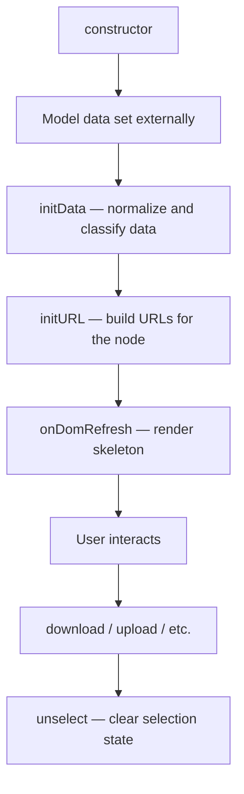

# Initialization

This group covers the methods responsible for setting up a media file system (MFS) node — from construction to data initialization and selection state reset.

---

## `constructor(...args)`

The entry point for creating an MFS node instance. Calls the parent class constructor and sets up the base object.

```js
constructor(...args) {
  super(...args);
}
```

In practice you rarely override this directly. All meaningful initialization happens in `initData()` after model data is available.

---

## `initData()`

Processes and normalizes raw model data into a usable form. Called after the model is populated — either on first load or after an upload completes.

### What it does

```
initData()
  │
  ├── Compute display values
  │     → age:  human-readable relative time  (e.g. "2 hours ago")
  │     → date: formatted timestamp           (e.g. "14 Mar 25 10:30:00")
  │     → size: human-readable file size      (e.g. "1.2 MB")
  │
  ├── Handle file vs. MFS node
  │     → if model has a raw file attached → set filename from name field
  │     → otherwise → set isMfs = 1 and continue
  │
  ├── Normalize filesize
  │     → hub / folder → force filesize to 0
  │     → regular file → parse filesize as integer
  │
  ├── Set type flags
  │     → isHubOrFolder, isHub, isFolder
  │
  └── Call metadata() to extract and flatten metadata fields
```

### When it's called

- On widget initialization after model data is ready
- After an upload completes (`onUploadEnd`) to refresh the node with new data

### Example

```js
// After model is populated, call initData to compute display values
this.model.set(data);
this.initData();
this.initURL();
```

### Type flags set by `initData`

| Flag                 | Set when                                          |
| -------------------- | ------------------------------------------------- |
| `this.isMfs`         | Node is a file system item (not a raw file input) |
| `this.isHubOrFolder` | `filetype` is `hub` or `folder`                   |
| `this.isHub`         | `filetype` is `hub`                               |
| `this.isFolder`      | `filetype` is `folder`                            |

> **Note:** `isHub` and `isFolder` are only set when `isSimple` is falsy. Simple nodes skip this classification.

---

## `unselect()`

Resets the selection state of the node. Defined as an **abstract method** — it intentionally does nothing in the base class and must be implemented by subclasses that support selection.

```js
unselect() {
  // Abstract -- do not remove
}
```

### When it's called

- After a download is triggered — to deselect the node once the action completes
- After a blob URL is consumed — as part of cleanup in `getBlob()`

```js
// Called automatically after download, with a delay
const f = () => {
  return this.logicalParent.unselect(2);
};
_.delay(f, 1000);
```

### How to implement in a subclass

Override `unselect` in any class that has a visual selection state:

```js
unselect(mode) {
  this.setState(0);           // clear selected state
  this.el.removeAttribute("data-selected");
}
```

> **Why keep an empty abstract method?** It provides a safe call target — callers can always call `unselect()` without checking whether the subclass implements it. If not overridden, it silently does nothing.

---

## Initialization Flow

How these three methods relate to each other in the widget lifecycle:



---

## Quick Reference

| Method        | When to call                            | Overridable                      |
| ------------- | --------------------------------------- | -------------------------------- |
| `constructor` | Automatically on instantiation          | ✅ Extend with `super(...args)`  |
| `initData()`  | After model data is ready or updated    | ✅ Call `super.initData()` first |
| `unselect()`  | After download or blob action completes | ✅ Must override to have effect  |
