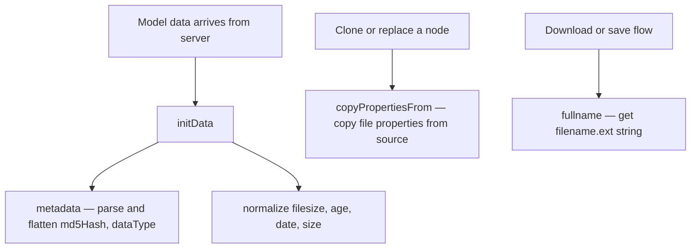

# Metadata

This group covers methods that read, normalize, and copy structured data associated with a media node — including its metadata object, file properties, and display name.

---

## `metadata()`

Reads and normalizes the `metadata` field from the node's model, then flattens key fields directly onto the model for easier access.

### What it does

```
metadata()
  │
  ├── Read model's metadata field (may be a plain object or a JSON string)
  │
  ├── If metadata is a string
  │     → JSON.parse(metadata)
  │     → if parse fails → return {}
  │
  ├── Extract: { md5Hash, dataType }
  ├── Flatten onto model: mset({ md5Hash, dataType })
  │
  └── Return the parsed metadata object
```

### Why it parses strings

Depending on the data source, `metadata` may arrive from the server as a JSON string rather than a parsed object. `metadata()` handles both shapes transparently so callers never need to check.

```js
// Server sends:  metadata: '{"md5Hash":"abc123","dataType":"diagram.state"}'
// After calling metadata():
this.mget("md5Hash"); // → "abc123"
this.mget("dataType"); // → "diagram.state"
```

### When it's called

Called automatically at the end of `initData()` — you rarely need to call it directly. Override it in a subclass if you need to extract additional fields from the metadata object:

```js
metadata() {
  const md = super.metadata();
  const { customField } = md;
  this.mset({ customField });
  return md;
}
```

### Return value

Returns the parsed metadata object (plain `{}`). Returns an empty object `{}` if the field is missing or unparseable.

---

## `copyPropertiesFrom(src)`

Copies a predefined set of file system properties from another media node (`src`) onto this node's model.

### Signature

| Param | Type     | Description                             |
| ----- | -------- | --------------------------------------- |
| `src` | MFS node | The source node to copy properties from |

### Properties copied

Only non-null values are copied — properties missing on `src` are skipped:

```
area          actual_home_id    ctime         ext
filename      filepath          filetype      filesize
geometry      home_id           hub_id        isalink
md5Hash       metadata          mtime         nid
origin        ownpath           pid           privilege
status
```

### When to use

Use `copyPropertiesFrom` when you need to transfer a node's identity and file attributes to another node — for example when cloning, replacing, or initializing a placeholder node from a real one:

```js
const placeholder = new pseudo_media();
placeholder.copyPropertiesFrom(realMediaNode);
```

> **Note:** Only properties with truthy values are copied. Falsy values (`null`, `0`, `""`, `undefined`) on the source are not transferred, preserving any existing values on the target.

---

## `fullname()`

Returns the complete filename with its extension as a single string.

### Signature

```js
fullname(); // → "document.pdf"
```

### What it does

```js
fullname() {
  return `${this.mget(_a.filename)}.${this.mget(_a.ext)}`;
}
```

Combines the `filename` and `ext` fields from the model. This is a simple convenience method — use it whenever you need the full file name with extension for display, download, or saving purposes.

### Example

```js
const name = this.fullname();
// → "quarterly-report.xlsx"

// Common use in download flow
const filename = this.fullname();
this.fetchFile({ url, download: filename });
```

> **Note:** If `filename` already contains the extension (e.g. `"report.pdf"`), calling `fullname()` will duplicate it → `"report.pdf.pdf"`. Use `mget(_a.filename)` directly in that case, or check `mget(_a.ext)` before calling.

---

## Method Relationships



---

## Quick Reference

| Method                    | Input           | Output                  | When to call                                             |
| ------------------------- | --------------- | ----------------------- | -------------------------------------------------------- |
| `metadata()`              | —               | Parsed metadata `{}`    | Auto via `initData()`, override to extract custom fields |
| `copyPropertiesFrom(src)` | Source MFS node | —                       | When cloning or initializing a node from another         |
| `fullname()`              | —               | `"filename.ext"` string | When the full filename with extension is needed          |
