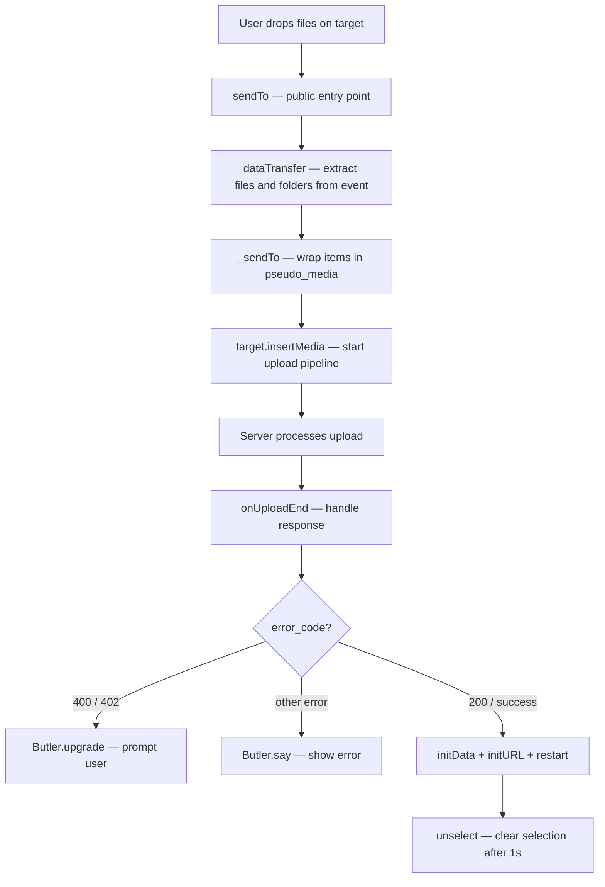

# Send Media

This group covers the methods responsible for uploading files and folders to a target location — from handling drag-and-drop transfers to processing server responses after an upload completes.

---

## Overview

```
User drops files / folders onto a target
  └── sendTo(target, e, p, token)
        └── dataTransfer(e) — extract files and folders from the drag event
              └── _sendTo(target, items, p, token)
                    └── wrap each file/folder in a pseudo_media
                          └── target.insertMedia(items, p)
                                └── upload completes
                                      └── onUploadEnd(response)
```

---

## `sendTo(target, e, p, token)`

The **public entry point** for sending files via a drag-and-drop event. Extracts transferable items from the browser event and passes them to `_sendTo`.

### Signature

| Param    | Type   | Description                                            |
| -------- | ------ | ------------------------------------------------------ |
| `target` | Object | The destination widget that will receive the media     |
| `e`      | Event  | The browser drag-and-drop event                        |
| `p`      | Object | Additional params passed to the target's `insertMedia` |
| `token`  | String | Optional auth token for DMZ / share uploads            |

### How it works

```js
sendTo(target, e, p, token) {
  const r = dataTransfer(e);       // extract { files: [...], folders: [...] }
  this._sendTo(target, r, p, token);
}
```

`dataTransfer(e)` normalizes the browser event into a structured `{ files, folders }` object — handling differences between browsers and drag sources automatically.

### Example

```js
// In a drop handler
onDrop(e) {
  this.sendTo(this.getLogicalParent(), e, { pid: this._currentPid });
}
```

---

## `_sendTo(target, items, p, token)`

The **internal implementation** of the send operation. Wraps each file and folder in a `pseudo_media` instance and delegates to the target's `insertMedia`.

### Signature

| Param    | Type   | Description                                                   |
| -------- | ------ | ------------------------------------------------------------- |
| `target` | Object | The destination widget                                        |
| `items`  | Object | `{ files: [...], folders: [...] }` — output of `dataTransfer` |
| `p`      | Object | Additional params passed to `insertMedia`                     |
| `token`  | String | Optional auth token attached to each pseudo_media             |

### What it does

```
_sendTo(target, items, p, token)
  │
  ├── For each file in items.files
  │     → create pseudo_media({ phase: "upload" })
  │     → set _a.file on it
  │     → if token → set _a.token on it
  │     → push to queue
  │
  ├── For each folder in items.folders
  │     → create pseudo_media()
  │     → set _a.folder on it
  │     → if token → set _a.token on it
  │     → push to queue
  │
  └── if queue is not empty
        → target.insertMedia(queue, p)
```

### Why `pseudo_media`?

Each item is wrapped in a `pseudo_media` — a lightweight placeholder that acts like a real media node during the upload phase. This allows the upload pipeline to treat files and folders uniformly, regardless of their source.

### Example

```js
// Directly calling _sendTo with pre-extracted items
this._sendTo(targetWidget, { files: [file1, file2], folders: [] }, { pid: 42 });
```

> **Note:** Prefer calling `sendTo` over `_sendTo` directly. `_sendTo` is an internal method and should only be called when items are already extracted outside of a drag event.

---

## `onUploadEnd(response, restartEvent)`

Called **automatically** when the server responds after an upload completes. Handles errors, updates the node's model with the new data, and re-initializes the widget.

### Signature

| Param          | Type   | Description                                              |
| -------------- | ------ | -------------------------------------------------------- |
| `response`     | Object | Server response: `{ error_code, error, data }`           |
| `restartEvent` | Event  | Optional — the original event used to restart the widget |

### Response handling

| `error_code`             | Behavior                                               |
| ------------------------ | ------------------------------------------------------ |
| `400` (quota exceeded)   | Prompt user to upgrade plan, then close widget         |
| `402` (payment required) | Prompt user to upgrade plan, then close widget         |
| `200`                    | Continue with success flow                             |
| Other + `error` present  | Show error message via `Butler.say()`, suppress widget |

### Success flow

After a successful upload, `onUploadEnd` distinguishes two cases:

**Replacing an existing file** (`this.mget(_a.file)` or `this.isReplacing`):

```
Clear model → set new data → initData() → initURL()
  └── if attachment → trigger restart + onDomRefresh
  └── otherwise    → restart(restartEvent) + enablePreview()
```

**Adding a new file** (no existing file reference):

```
initData() → initURL() → restart(restartEvent) → enablePreview()
```

In both cases, a delayed `unselect()` is called on the logical parent after 1 second to clear the selection state.

### Example

```js
// onUploadEnd is called automatically by the upload pipeline
// You don't call it directly — but you can override it to add custom logic:

onUploadEnd(response, restartEvent) {
  super.onUploadEnd(response, restartEvent);
  // custom post-upload logic here
}
```

---

## Method Relationships



---

## Quick Reference

| Method        | Called by                   | Calls                                                         |
| ------------- | --------------------------- | ------------------------------------------------------------- |
| `sendTo`      | External (drop handler)     | `dataTransfer`, `_sendTo`                                     |
| `_sendTo`     | `sendTo`                    | `pseudo_media`, `target.insertMedia`                          |
| `onUploadEnd` | Upload pipeline (automatic) | `initData`, `initURL`, `restart`, `enablePreview`, `unselect` |
