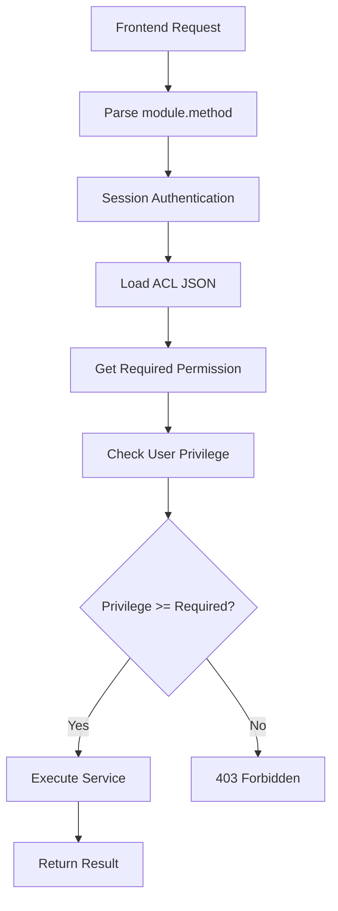

# Access Control List (ACL) System

Drumee's ACL system is a **bitwise, Linux-inspired permission model** that controls access to every backend service. Each service is declared in a JSON configuration file. The server reads this configuration to determine whether to execute a request or reject it before any service code runs.



## Permission Levels

Drumee uses a numeric bitwise privilege model. Higher values include the capabilities of all lower values.

| Level | Value | Description |
|-------|-------|-------------|
| `anonymous` | 0 | No authentication required. Open to any request. |
| `read` | 2 | Authenticated user with at least read access on the resource. |
| `write` | 4 | Authenticated user with write access. |
| `admin` | 6 | Hub or domain administrator. |
| `owner` | 7 | The resource owner. Highest privilege level. |

## Scope Types

The `scope` field in an ACL entry defines the context in which the service operates.

| Scope | Description |
|-------|-------------|
| `hub` | Requires an active Hub context. The request must include a `hub_id` or be routed to a Hub endpoint. |
| `domain` | Requires domain-level authentication. Used for organisation-wide operations. |
| `public` | No Hub context required. Accessible from the public API endpoint (`/-/api/`). |

## ACL JSON Structure

Each module has a corresponding JSON file in the `acl/` directory. The file defines every service the module exposes, along with its permission requirements and optional metadata.

```json
{
  "services": {
    "service_name": {
      "scope": "hub",
      "permission": {
        "src": "read"
      },
      "method": "actual_js_method_name",
      "log": true
    }
  },
  "modules": {
    "private": "service/private/module_name",
    "public": "service/module_name"
  }
}
```

### Fields Reference

| Field | Required | Description |
|-------|----------|-------------|
| `scope` | Yes | Access context: `hub`, `domain`, or `public` |
| `permission.src` | Yes | Minimum privilege level required |
| `permission.fast_check` | No | Additional runtime check before execution (e.g., `user_permission`, `public-api`) |
| `method` | No | Maps the service name to a differently named JavaScript method |
| `log` | No | When `true`, the service call is written to the audit log |
| `preproc` | No | Pre-processing configuration (e.g., file upload handling) |
| `modules.private` | No | Path to the private service implementation file (authenticated) |
| `modules.public` | No | Path to the public service implementation file (unauthenticated) |

### The `fast_check` Mechanism

Some services require a contextual check beyond the static permission level. The `fast_check` value triggers a runtime verification before the service method runs.

| Value | Behaviour |
|-------|-----------|
| `user_permission` | Verifies the user holds the required privilege on the specific MFS node being accessed, not just on the Hub in general |
| `public-api` | Allows the service to be called without a full authenticated session, typically for guest or token-based access |

### Method Aliases

When the ACL service name differs from the JavaScript method name, the `method` field creates a mapping:

```json
"show_tag_by": {
  "scope": "hub",
  "permission": { "src": "owner" },
  "method": "tag_get_next"
}
```

The client calls `tagcontact.show_tag_by` but the server dispatches to the `tag_get_next` method.

## Service Endpoint Pattern

All backend services are accessed through a single entry point:

```
https://hostname/-/svc/module.method
```

For public services (scope `public`):

```
https://hostname/-/api/module.method
```

There are no hard-coded routes. Every module and method combination is resolved dynamically from the ACL configuration.

## Request / Response Model

Drumee uses a data-driven, JSON-only communication model. Requests are submitted as POST with a JSON body (or query parameters for GET). Responses are always JSON.

**Request:**
```bash
curl -X POST https://hostname/-/svc/mfs.node_summary \
  -H "Content-Type: application/json" \
  -d '{"hub_id": "abc123", "nid": "def456"}'
```

**Response:**
```json
{
  "data": {
    "filename": "My Folder",
    "category": "folder",
    "file_count": 12,
    "total_size": 5242880
  }
}
```

## Adding a New Service

To expose a new backend method, two steps are required:

**1. Implement the method** in the service file:

```js
// service/private/mymodule.js
async my_action() {
  const id = this.input.need('id');
  const result = await this.db.await_proc('my_proc', id);
  this.output.data(result);
}
```

**2. Declare it in the ACL file:**

```json
// acl/mymodule.json
{
  "services": {
    "my_action": {
      "scope": "hub",
      "permission": { "src": "write" }
    }
  },
  "modules": {
    "private": "service/private/mymodule"
  }
}
```

No route registration, no middleware wiring — the ACL file is the complete declaration.

## Security Properties

- **No implicit access**: A method that has no ACL entry is unreachable from the network, regardless of whether it exists in the service file.
- **Permission enforced before execution**: The server checks the ACL before calling any service method. A service implementation can assume the caller is already authorised.
- **Additive documentation fields**: The `doc`, `params`, `returns`, and `errors` fields added during the documentation enhancement phase are purely informational. The parser only reads the runtime fields (`scope`, `permission`, `method`, `log`, `preproc`, `modules`). Documentation fields have zero effect on runtime behaviour.

## Related Topics

- [MFS Architecture](mfs) — How file permissions integrate with the ACL system
- [Backend SDK Reference](../api-reference/backend-sdk/index) — Full API reference for all modules
- [Creating a Service](../guides/creating-service) — Step-by-step guide to adding a new service
- [Permission Management](../guides/permission-management) — Managing user privileges