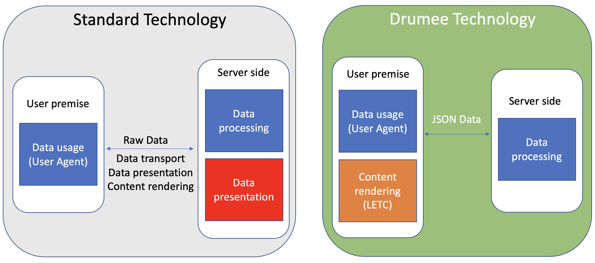

# LETC Engine

**LETC** (Limitlessly Extensible Tree Components) is Drumee's declarative UI rendering engine. Instead of generating HTML on the server or shipping a JavaScript bundle that constructs the DOM, Drumee describes user interfaces as **JSON trees** that the client renders locally.

[Try LETC in the sandbox →](https://drumee.com/-/#/sandbox)

## The Problem with Conventional Approaches

Most web frameworks face a structural conflict: the User Interface is a client-side concern, but frameworks process and deliver it through the server.

This creates two common but problematic patterns:

**Pattern A — Server-rendered HTML**
The server generates HTML and sends it to the client. This means server CPU is spent rendering UI that the client's browser could do itself. Worse, mixing backend and frontend code in the same codebase degrades readability and introduces security surface (e.g., accidental data exposure through rendered templates).

**Pattern B — JavaScript bundles**
A framework like React generates a large JS bundle that constructs the DOM on the client. This solves the server-rendering problem but still requires the server to understand UI concerns during the build step. Bundles grow large, hot-reload cycles are slow, and extending the UI requires recompiling code.

## The LETC Approach

LETC decouples UI definition from both server logic and client compilation.

The server returns **pure data** as JSON. The LETC renderer on the client reads a JSON tree, resolves each node to a registered widget component, and renders the interface. No HTML is generated server-side. No re-compilation is needed to add or modify a widget.

```
Server → JSON tree → LETC Renderer → DOM
```

### Example: A Simple UI Tree

```json
{
  "kind": "container",
  "children": [
    {
      "kind": "heading",
      "content": "My Files",
      "level": 2
    },
    {
      "kind": "data-grid",
      "service": "mfs.list",
      "columns": ["filename", "filesize", "mtime"]
    }
  ]
}
```

The renderer looks up `"kind": "data-grid"` in its widget registry and instantiates the correct component with the provided properties. No server involvement beyond returning the initial JSON.

## Key Properties

### No Hard-Coded Routes

The LETC engine does not bind UI views to URL paths. Navigation is driven by the JSON tree itself. A node can declare a `service` call that fetches and replaces the current tree fragment, enabling SPA-style navigation without a router configuration file.

### Extensibility via Widget Registry

Any team or plugin author can register custom widget kinds. The registry maps `"kind": "my-widget"` to a component implementation. This makes Drumee UI fully extensible without modifying the core engine — the same model used in the backend SDK where adding an ACL JSON entry exposes a new service endpoint.

### Permission-Aware Rendering

Because the JSON tree is assembled server-side from Drumee service calls, the server naturally omits nodes the current user does not have permission to see. The client never receives UI fragments it should not render — there is no client-side `if (user.isAdmin)` hiding.

### JSON-Only Communication

All data exchanged between LETC and the backend travels as JSON over the standard service endpoint (`/-/svc/module.method`). LETC makes no distinction between a "UI call" and a "data call" — they are the same mechanism, governed by the same ACL rules.

## Architecture Diagram



The diagram shows the full flow:

1. The user interacts with a LETC component
2. The component calls a Drumee service via `/-/svc/`
3. The server validates the ACL, executes the service, returns JSON
4. LETC merges the response into the current tree, re-rendering only the affected subtree

This is the Drumee **client-server separation principle**: the server is a pure data processor, the client is a pure renderer.

## Relationship to the Backend SDK

From the backend's perspective, LETC is simply a consumer of the service API. The backend does not know or care that the caller is a LETC renderer rather than a mobile app or a CLI tool. The ACL system enforces access the same way regardless of the caller.

A backend developer adding a new service does not need to write any frontend code. Once the ACL entry and service method are in place, a LETC developer can immediately call it by referencing `module.method` in a widget's `service` property.

## Related Topics

- [Core Concepts — Overview](overview) — General Drumee architecture
- [ACL System](acl-system) — How service access is controlled
- [Creating a Service](../guides/creating-service) — Add a new backend service callable from LETC
- [ACL Spec Reference](../api-reference/acl-spec) — Full ACL JSON field reference