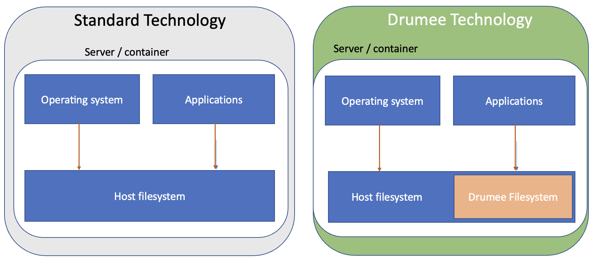

# Meta File System (MFS)

MFS, for **Meta File System**, is Drumee's internal file management layer. Unlike standard web applications that expose the host file system directly to application logic, MFS adds a full abstraction layer that makes file handling safer, more flexible, and permission-aware at every level.



## Why MFS Exists

Standard applications that work directly with the host file system face several structural problems:

- The entire host file system is potentially reachable if the application has a vulnerability
- There is no built-in concept of ownership or per-user isolation
- Moving, copying, or trashing files requires writing custom logic in every service
- No unified way to attach metadata (MIME type, category, visibility) to files

MFS solves all of these by storing the **logical representation of files and folders in a database** and keeping physical files in an isolated, content-addressed storage directory. The application never constructs raw filesystem paths from user input.

## Core Concepts

### Nodes

Everything in MFS is a **node**. A node can be:

| Category | Description |
|----------|-------------|
| `folder` | A directory that contains other nodes |
| `file`   | An uploaded file (document, image, video, etc.) |
| `hub`    | A special root folder that belongs to a Hub (shared workspace) |

Each node has a unique `id` (UUID), an `owner_id`, a `parent_id` pointing to its container, and a set of metadata fields including `filename`, `mimetype`, `category`, `filesize`, and `extension`.

### Physical Storage

Physical files live under a content-addressed path:

```
{mfs_dir}/{VFS_ROOT_NODE}/{node_id}/
```

The application never exposes this path to the client. Downloads and uploads go through MFS service endpoints that perform permission checks before any I/O.

### The Media Table

The central database table is `media`. Every node in every hub and every personal drive is a row in a `media` table. Each Hub and each user has its own database, so the `media` table is scoped per owner. Cross-hub queries use Drumee's stored procedure convention of prefixing the database name.

Key columns:

| Column | Description |
|--------|-------------|
| `id` | UUID — primary key and physical storage address |
| `parent_id` | UUID of the parent folder node |
| `owner_id` | UUID of the owning user |
| `filename` | Internal filename |
| `user_filename` | Display name shown to users |
| `mimetype` | MIME type of the file |
| `category` | Logical type: `folder`, `file`, `hub`, etc. |
| `filesize` | Size in bytes |
| `extension` | File extension without the dot |
| `metadata` | JSON blob for arbitrary additional data |
| `show` | Visibility flag |
| `ctime` | Creation Unix timestamp |
| `mtime` | Last modification Unix timestamp |

### Trash System

Deleted nodes are not immediately removed. They are moved to a `trash_media` table with a `trashed_time` timestamp. This allows users to restore files within a configurable expiry window. Once the expiry period passes, the expiry worker permanently deletes the physical files and purges the database record.

## Key Stored Procedures

MFS operations are performed exclusively through stored procedures. Services never run raw SQL against the `media` table directly.

| Procedure | Purpose |
|-----------|---------|
| `mfs_create_node` | Create a new file or folder node |
| `mfs_move` | Move a node to a different parent |
| `mfs_copy` | Copy a node and its children |
| `mfs_trash_media` | Soft-delete: move node to trash |
| `mfs_restore` | Restore a node from trash |
| `mfs_purge` | Hard-delete a node record |
| `mfs_empty_trash` | Permanently delete all expired trash nodes |
| `mfs_manifest` | Get the full recursive file list under a node |
| `mfs_access_node` | Check whether a user can access a given node |
| `mfs_get_by` | Fetch a node record by various criteria |

## Permission Model

Every MFS node carries a permission level. Drumee uses a bitwise permission system:

| Level | Value | Who |
|-------|-------|-----|
| `anonymous` | 0 | Public, no authentication |
| `read` | 2 | Any authenticated user with read access |
| `write` | 4 | Users with write access |
| `admin` | 6 | Hub administrators |
| `owner` | 7 | The node owner |

The `permission_grant` procedure assigns a privilege level to a specific entity (user, group, or wildcard `*`) on a node for a defined duration. The `permission_revoke` procedure removes it.

## Service Layer Integration

MFS services receive a resolved node via `this.granted_node()` or `this.source_granted()`. These methods perform the ACL check and return the node object only if the current user has sufficient privilege. A service never needs to check permissions manually — the ACL configuration in the JSON file handles the gate, and `granted_node()` provides the already-verified result.

Example service pattern:

```js
async move() {
  const node = this.granted_node();      // permission already checked
  const pid  = this.input.need('pid');   // required: destination folder id
  await this.db.await_proc('mfs_move', node.id, pid);
  this.output.data({ nid: node.id });
}
```

## SEO Integration

When a file is created or modified, Drumee can register it in the `seo_index` and `seo_register` tables. This enables the platform's internal search engine to index documents without exposing file paths directly. The SEO indexing pipeline runs asynchronously and does not block file operations.

## Related Topics

- [ACL System](acl-system) — How permissions are enforced at the service level
- [Backend SDK — mfs](../api-reference/backend-sdk/mfs) — MFS service API reference
- [Backend SDK — media](../api-reference/backend-sdk/media) — Media service API reference
- [Backend SDK — trash](../api-reference/backend-sdk/trash) — Trash expiry configuration