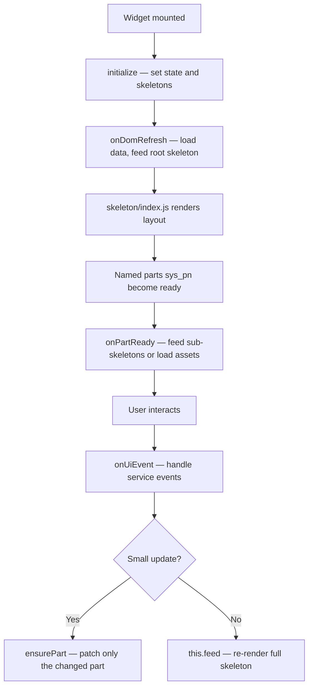

# Creating a Widget

This guide helps you understand how to build a **widget** in Drumee — from folder structure to rendering, data loading, and user interactions.

> **Who is this for?** Anyone new to Drumee who wants to create a new UI module (widget) from scratch.

---

## What is a Widget?

A **widget** is a self-contained UI module. It manages its own:
- **State** (data it holds in memory)
- **Layout** (how it looks, via skeletons)
- **Behavior** (how it reacts to user actions, via services)
- **Styling** (its own SCSS skin)

Think of it like a mini-app living inside the Drumee shell.

---

## Folder Structure

Every widget follows the same layout:

```
my-widget/
├── skeleton/
│   ├── index.js      ← Root layout (what the widget looks like)
│   └── ...           ← Sub-skeletons for pages or sections
├── skin/
│   └── index.scss    ← All styles for this widget
└── index.js          ← The brain: state, services, event handling
```

| File/Folder | Role |
|---|---|
| `index.js` | Controller — manages state, calls APIs, handles UI events |
| `skeleton/` | Templates — pure functions that return UI trees |
| `skin/` | Styles — SCSS using BEM naming |

---

## Step-by-Step: Building a Widget

### Step 1 — Create `index.js` (the controller)

This is where your widget logic lives. Start by extending the base class:

```js
const BaseWidget = require("..");

class my_widget extends BaseWidget {

  initialize(opt = {}) {
    super.initialize(opt);

    // Declare your state here
    this._data = null;
  }

  async onDomRefresh() {
    // Called when the widget is mounted to the page
    // 1. Load any required data
    // 2. Feed the root skeleton
    this.feed(require("./skeleton").default(this));
  }

}

module.exports = my_widget;
```

> **Rule:** Always declare state in `initialize()`. Never create new state properties inside other methods.

---

### Step 2 — Create `skeleton/index.js` (the layout)

A skeleton is a **pure function** that receives the widget (`ui`) and returns a component tree. It never holds state.

```js
export default function (ui) {
  const fig = ui.fig.family; // your widget's BEM namespace, e.g. "my-widget"

  return Skeletons.Box.Y({
    className: `${fig}__main`,
    kids: [

      // Header
      Skeletons.Box.X({
        className: `${fig}__header`,
        kids: [
          Skeletons.Element({
            className: `${fig}__title`,
            content: "My Widget",
          }),
        ],
      }),

      // Content area — named so the controller can reference it later
      Skeletons.Box.Y({
        className: `${fig}__content`,
        sys_pn: "content",        // ← named part
        uiHandler: [ui],
      }),

    ],
  });
}
```

**What is `sys_pn`?**  
`sys_pn` gives a part a name so the controller can find and update it later without re-rendering the whole widget. Think of it like an `id` on a DOM element.

---

### Step 3 — React to parts becoming ready

When a named part (`sys_pn`) is rendered, `onPartReady` is called. Use this to feed sub-skeletons into it:

```js
onPartReady(child, pn) {
  switch (pn) {
    case "content":
      child.feed(require("./skeleton/my-page").default(this));
      break;
  }
}
```

---

### Step 4 — Create `skin/index.scss` (the styles)

Use BEM with your widget's class name as the root block:

```scss
.my-widget {

  &__main {
    background: var(--neutral-100);
    padding: var(--spacer-6);
  }

  &__header {
    align-items: center;
    justify-content: space-between;
  }

  &__title {
    font-size: 24px;
    font-weight: 600;
  }

  &__content {
    flex: 1;
  }

}
```

> Always use CSS variables from the design system (`var(--spacer-4)`, `var(--neutral-100)`, etc.) — never hardcode values.

---

## Handling User Events

All user interactions flow through a single method: `onUiEvent`.

In your skeleton, attach a `service` name to any clickable element:

```js
Skeletons.Button.Svg({
  className: `${fig}__my-button`,
  service: "do-something",   // ← triggers onUiEvent with this service name
  uiHandler: [ui],
})
```

Then handle it in your controller:

```js
async onUiEvent(cmd, args = {}) {
  const service = args.service || cmd.get(_a.service);

  switch (service) {
    case "do-something":
      // your logic here
      break;

    case "close-overlay":
      this.goodbye();
      break;
  }
}
```

---

## Loading Data from the Server

Use `fetchService` (GET) or `postService` (POST) to call backend services:

```js
// GET
async loadMyData() {
  try {
    const data = await this.fetchService({
      service: SERVICE.my_module.get_data,
      uid: Visitor.id,
    });
    this._data = data;
  } catch (e) {
    this.warn("[my-widget] loadMyData failed", e);
  }
}

// POST
async saveMyData(payload) {
  try {
    const result = await this.postService(SERVICE.my_module.save_data, {
      uid: Visitor.id,
      ...payload,
    });
    return result;
  } catch (e) {
    this.warn("[my-widget] saveMyData failed", e);
    throw e;
  }
}
```

**Best practices:**
- Cache results in instance variables (`this._data`) and check before re-fetching
- Always `try/catch` async calls
- Trigger a re-render only after data is ready

---

## Updating the UI Without Full Re-render

When only part of the UI needs to change, use `ensurePart` to target a named part (`sys_pn`) directly:

```js
// Re-render the entire widget — use sparingly
this.feed(require("./skeleton").default(this));

// Patch only one named part — preferred
this.ensurePart("my-section").then((part) => {
  part.feed(require("./skeleton/my-section").default(this));
});

// Update text content of a part
this.ensurePart("my-label").then((part) => {
  part.set({ content: "Updated!" });
});
```

> **Rule of thumb:** Use `ensurePart` for small updates. Only call `this.feed(...)` when the whole layout needs to change (e.g. switching pages).

---

## Lazy Loading Assets

For images or SVGs, load them lazily to avoid blocking the initial render:

```js
preloadAsset(pn) {
  switch (pn) {
    case "my-banner":
      import("../../assets/images/banner.svg").then((m) => {
        this.ensurePart(pn).then((p) => {
          p.el.style.backgroundImage = `url(${m.default})`;
        });
      });
      break;
  }
}

onPartReady(child, pn) {
  switch (pn) {
    case "my-banner":
      this.preloadAsset(pn);
      break;
  }
}
```

---

## Full Lifecycle at a Glance



---

## Quick Reference

| Task | How |
|---|---|
| Set initial state | `initialize()` |
| Render the widget | `this.feed(skeleton(this))` in `onDomRefresh` |
| Feed a sub-section | `onPartReady` → `child.feed(...)` |
| Handle a button click | `service:` on skeleton element + `onUiEvent` switch |
| Fetch data (GET) | `this.fetchService({ service: ... })` |
| Post data (POST) | `this.postService(SERVICE.x.y, { ... })` |
| Patch one UI part | `this.ensurePart("pn").then(p => p.feed(...))` |
| Update text only | `this.ensurePart("pn").then(p => p.set({ content: "..." }))` |
| Load image lazily | `import("./asset.svg").then(...)` inside `preloadAsset` |
| Close the widget | `this.goodbye()` |

---

## Checklist

- [ ] `index.js` extends the base class and declares all state in `initialize()`
- [ ] `onDomRefresh()` loads required data then calls `this.feed(skeleton(this))`
- [ ] Root skeleton uses `sys_pn` on every dynamic section
- [ ] `onPartReady` handles all named parts
- [ ] User interactions go through `onUiEvent` with named `service` strings
- [ ] API calls are wrapped in `try/catch` and results cached in `this._*`
- [ ] UI updates use `ensurePart` for patches, `this.feed` only for full re-renders
- [ ] Styles use BEM with `fig.family` as the root block and design system variables
