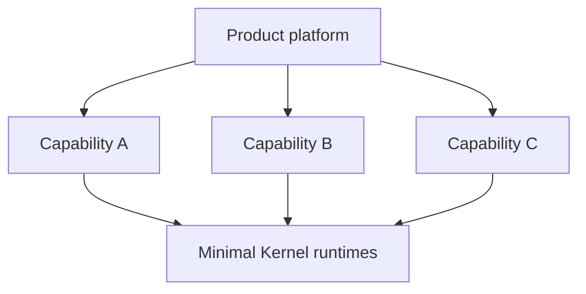

# Who is the Minimal Kernel for?

The Minimal Kernel becomes relevant when identity, permissions, persistent resources, realtime behavior, and modularity are architectural properties of an application rather than isolated features.

It is not a general-purpose shortcut for every web project. Adopting it means accepting a client-rendered LETC UI model, Drumee session and ACL contracts, package boundaries, and—when MFS is used—MariaDB-backed logical resource identities.

## Application developers

Application code builds above shared mechanisms:

| Kernel provides | The application still owns |
|---|---|
| principal and session mechanisms | sign-in experience and business rules |
| ACL evaluation mechanisms | service descriptors and business permissions |
| service dispatch | business workers and responses |
| WebSocket association and routing | event meaning and recipient projection |
| LETC UI runtime | product interface and navigation |
| optional MFS tree and permission primitives | content policy, transfer UX, search, quota, trash |
| plugin loading | capability bundles and release lifecycle |

This split suits multi-user, workspace-oriented, collaborative, or desktop-like browser applications whose resources and services need explicit identities and permissions.

## Platform and framework developers

The Kernel provides common contracts while capabilities remain independently evolvable:

Changing the Kernel is appropriate only for application-neutral, cross-cutting execution concerns. A feature needed by one product normally belongs to a capability—even if historical Drumee implemented it in a central repository.

## Product, vendor, and self-hosting teams

The architecture may fit document-oriented products, collaborative tools, internal business platforms, vertical software, or persistent-workspace applications when they need several of the following together:

- self-controlled service, database, and content-storage boundaries;
- multiple principals and explicit domain or resource permissions;
- realtime updates associated with sessions;
- independently packaged backend and frontend behavior;
- rich client-side composition rather than server-rendered pages.

Self-hosting teams should note the present operational maturity. The verified integration environment uses Linux, Docker, MariaDB, Redis, Nginx, and unpublished modules from `transient`. It proves the architecture; it is not a supported production installer or an availability/SLA claim.

Open-source contributors should distinguish **building on** the Kernel from **changing** it. Product behavior belongs in capabilities. Runtime changes must preserve standalone packaging, fail-closed authorization, and the invariants listed in [Kernel Invariants](/kernel/invariants).

## Relevant project patterns

- **Multi-user applications:** session principals, domain ACL, and resource ACL seams are first-class.
- **Workspace and filesystem-oriented applications:** System MFS supplies logical `{hub_id, nid}` identities, trees, permission primitives, and per-entity shard provisioning.
- **Collaborative applications:** WebSocket routing and recipient-specific event projection support synchronized clients; applications still define collaboration semantics.
- **Modular products:** ACL descriptors and frontend plugin indices let backend and frontend capabilities load through explicit runtime contracts.
- **Desktop-like web applications:** LETC widgets and the optional Window Manager provide dynamic client-side composition.
- **Self-hosted software:** current components expose database, Redis, content, and reverse-proxy boundaries, but production packaging remains outside the Minimal Kernel deliverable.

## Composability status

| Combination | Status | Evidence and constraint |
|---|---|---|
| Backend capability on `server-runtime` only | **Supported** | The Hello service tests dispatch without UI, MFS, Finder, or Window Manager. A host must inject stores and adapters. |
| Frontend capability on `ui-runtime` only | **Supported** | The package and LETC tests run without a backend; remote plugin discovery and services require a compatible transport. |
| Application without Finder | **Supported** | Finder is absent from all four standalone package dependencies. |
| Application without Window Manager | **Supported** | Finder core is independent; only `FinderWindow` needs Window Manager. |
| MFS without Finder | **Supported** | `@drumee/system-mfs` has no npm runtime dependencies and exposes backend filesystem/provisioning APIs. |
| Runtime services without System MFS | **Supported** | Hello, authentication, domain ACL, plugins, and push are validated without MFS. |
| Finder without System MFS-compatible services | **Unsupported** | Finder requires `MfsClient`; upload/download additionally require `MfsTransferClient`. |
| Browser Finder as a standalone published package | **Not currently validated** | Finder remains a private Phase 4.8 integration module pending standalone extraction. |
| Server-side rendering | **Unsupported by the current UI runtime** | `ui-runtime` is browser/CommonJS/Webpack-oriented and explicitly excludes SSR. |

## When it is the wrong abstraction

Prefer a simpler stack for static sites, blogs, landing pages, small stateless APIs, or simple CRUD applications. The Kernel is also not a component library, a finished SaaS product, an SSR framework, or a drop-in solution for an identity/permission model fundamentally different from Drumee's principal, domain, and MFS contracts.

## Decision guide

The Minimal Kernel may be a good fit if most answers are “yes”:

- Do multiple users or principals exist?
- Are permissions more detailed than route roles?
- Do users manipulate persistent resources or workspaces?
- Do clients need realtime synchronization?
- Will independently evolving capabilities make up the product?
- Is self-controlled hosting and data placement important?
- Should business capabilities be separated from runtime infrastructure?
- Does the browser require rich client-side interaction?

You probably do not need it if the application is essentially static, is a small stateless service, is already covered by a simple CRUD framework, needs only visual components, or needs a finished product rather than an application kernel.

### Examples

1. A self-hosted document workspace with per-folder permissions, live updates, and pluggable document tools is a strong architectural fit.
2. A vertical operations product with several independently released workspaces may benefit from runtime/capability separation, even if it does not use Finder.
3. A backend-only multi-user service can use server runtime contracts without adopting the UI runtime or MFS.
4. A company landing page is a poor fit; identity, ACL, persistence, and realtime infrastructure would be unnecessary.
5. A server-rendered commerce storefront is a poor current fit because the UI runtime has no SSR contract.

