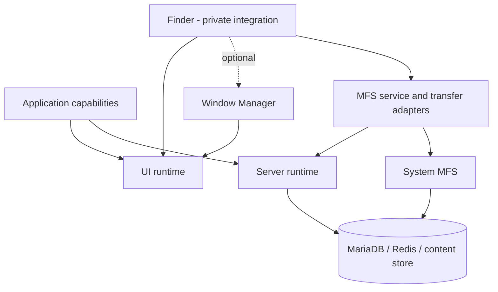
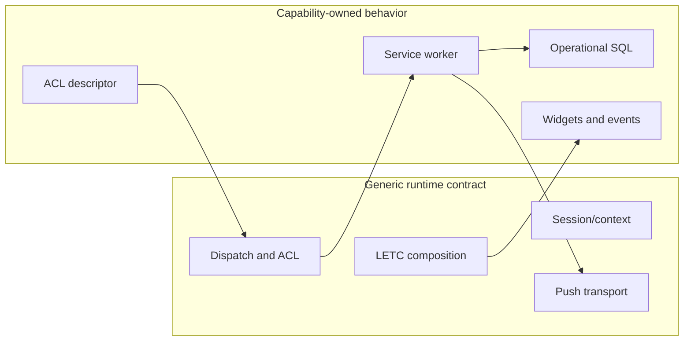

# Architecture and boundaries

The Kernel separates generic execution from system capabilities and applications.

## Layers

**`server-runtime`** owns HTTP/session adaptation, descriptors, authorization orchestration, service dispatch, plugin resolution, WebSocket routing, push, and intrinsic Yellow Page SQL. It has no MFS, Finder, Team, or Hub business dependency.

**`ui-runtime`** owns browser bootstrap, service transport, WebSocket client behavior, Kind/addon loading, and the extracted non-MFS LETC Widget/Skeleton/State subset. It has no Finder, Window Manager, Team, or MFS dependency and no SSR contract.

**`system-mfs`** is an optional backend capability. It installs its own lifecycle state, provisions SQL into existing entity shards, and provides procedure-backed filesystem and permission primitives. It is deliberately not part of generic server dispatch.

**Window Manager** is an optional UI capability above `ui-runtime`. It owns window policy and jQuery UI interactions without owning application content.

**Finder** is currently a private integration capability. Its core is Window-Manager-independent; its optional adapter presents Finder inside a managed window. MFS service and transfer adapters connect it to System MFS and the runtime.

**`transient`** is the current integration and evidence environment. It is not the final Kernel repository or a public package boundary.

## Kernel versus capability

## Dependency rules

Dependencies point downward toward contracts. Generic runtimes must not import application repositories or sibling packages through hidden paths. Capabilities may depend on runtimes and on explicit capability APIs. Application policy must not move into a runtime merely to make integration convenient.

The Kernel must not absorb product navigation, Team/Desk semantics, Hub business policy, Finder behavior, capability SQL, upload/archive workflow, or deployment-specific configuration. Historical code may be behavioral evidence, but is not an implicit dependency.

Auditable sources include `server-runtime/lib/`, `ui-runtime/src/`, `system-mfs/lib/`, `window-manager/lib/`, and `transient/target/modules/`.
