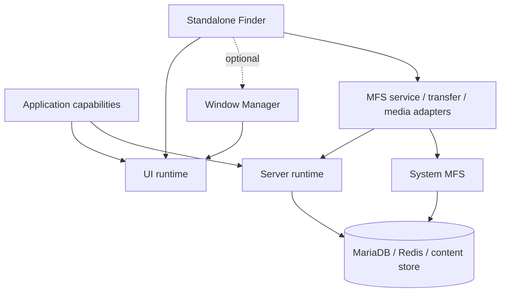
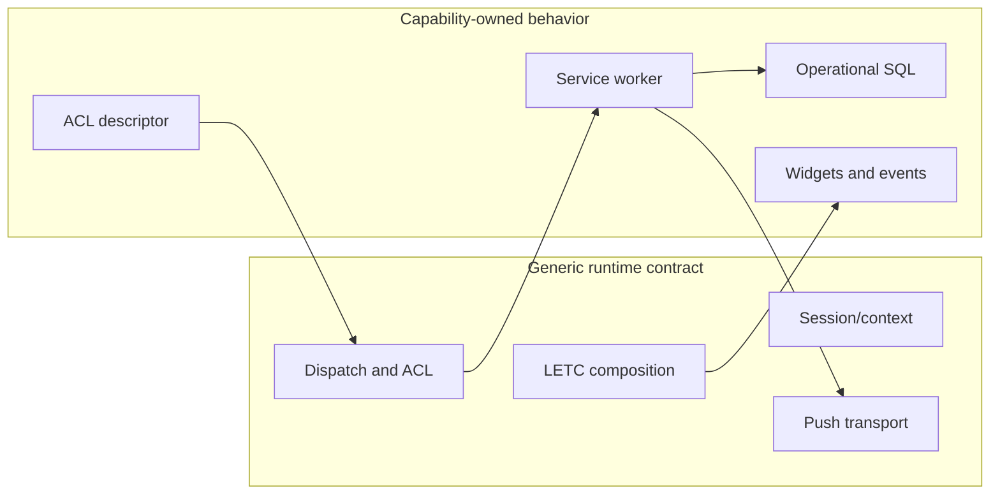

# Architecture and boundaries

The Kernel separates generic execution from system capabilities and applications.

## Layers

**`server-runtime`** owns HTTP/session adaptation, descriptors, authorization orchestration, service dispatch, plugin resolution, WebSocket routing, push, and intrinsic Yellow Page SQL. It has no MFS, Finder, Team, or Hub business dependency.

**`ui-runtime`** owns browser bootstrap, service transport, WebSocket client behavior, Kind/addon loading, and the extracted non-MFS LETC Widget/Skeleton/State subset. It has no Finder, Window Manager, Team, or MFS dependency and no SSR contract.

**`system-mfs`** is an optional backend capability. It installs its own lifecycle state, provisions SQL into existing entity shards, and provides procedure-backed filesystem and permission primitives. It is deliberately not part of generic server dispatch.

**Window Manager** is an optional UI capability above `ui-runtime`. It owns window policy and jQuery UI interactions without owning application content.

**Finder** is a standalone optional browser capability. Finder core depends on `ui-runtime` and logical MFS-compatible service contracts. It owns browser-side navigation, listing, selection, drag/drop, transfer orchestration, media-preview requests, and synchronization. The separately exported `FinderWindow` adapter presents one Finder inside Window Manager; core Finder does not require Window Manager.

**MFS service, transfer, and media adapters** are backend capability code. They connect runtime ACL and trusted session context to System MFS, bounded transfer state, host-filesystem abstractions, representation generation, and FileIo/Nginx delivery. Finder sees logical nodes, events, progress, and retrieval URLs—not SQL, shards, physical paths, `payload_ref`, archive bytes, or media generators.

**`transient`** is the integration and evidence environment. It carries bootstrap, Hello, backend MFS adapters, the kernel test environment, and cross-package validation. It is not a production Finder source repository or a public package boundary.

## Kernel versus capability

## Dependency rules

Dependencies point downward toward contracts. Generic runtimes must not import application repositories or sibling packages through hidden paths. Capabilities may depend on runtimes and on explicit capability APIs. Application policy must not move into a runtime merely to make integration convenient.

The Kernel must not absorb product navigation, Team/Desk semantics, Hub business policy, Finder behavior, capability SQL, upload/archive workflow, or deployment-specific configuration. Historical code may be behavioral evidence, but is not an implicit dependency.

The engineering priorities follow from these boundaries: authorize before executing capability work; give transfer maps, workers, tempfiles, listeners, and observers explicit bounded lifetimes; keep large payloads filesystem-backed and out of structured control requests; and split capabilities and SQL into independently owned units when the contract permits it. The runtime's generic `stop()` safeguard remains useful, but it does not replace component-specific cleanup.

Auditable current sources are the public [`server-runtime`](https://github.com/drumee/server-runtime), [`ui-runtime`](https://github.com/drumee/ui-runtime), [`system-mfs`](https://github.com/drumee/system-mfs), [`window-manager`](https://github.com/drumee/window-manager), and [`finder`](https://github.com/drumee/finder) repositories.

`transient` supplies integration evidence and canonical refactoring records.
