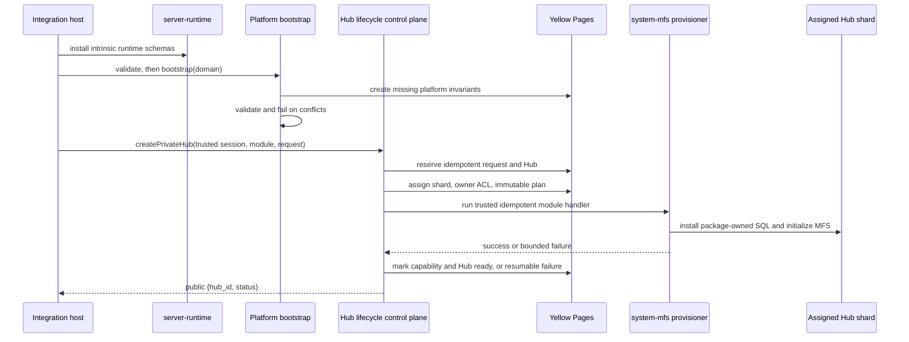

# Bootstrap and provisioning

Four different operations are involved. Installing runtime schemas does not
bootstrap platform identities. Platform bootstrap does not create a Hub or an
MFS namespace. Creating a Hub does not move module SQL into the runtime.



## 1. Runtime schema installation

`@drumee/server-runtime` installs only the Yellow Page objects intrinsic to
session, identity, domain authorization, transport, and dispatch. Runtime
startup consumes platform invariants; it does not create or silently repair
them. MFS tables, Hub lifecycle tables, application tables, and shard content
are outside the runtime schema manifest.

## 2. Platform bootstrap

The current controller is private transitional code in
`transient/target/control-plane/bootstrap`; its function names are not a
promised public API. Read-only validation is separate from mutating bootstrap.
Bootstrap requires a domain, rejects conflicting state before mutation,
installs its organisation table, and performs the creation step in a
transaction.

The canonical numeric platform references are:

```text
domain.id              = 1
organisation.sys_id    = 1
organisation.domain_id = 1
nobody uid             = ffffffffffffffff
```

The organisation's opaque `organisation.id` is generated; it is not the
numeric constant `1`. Guest and system UIDs are also generated with the
runtime-owned `uniqueId()` function. Bootstrap records
`sys_conf.nobody_id` and `sys_conf.guest_id`; system is resolved uniquely by
its username in Domain 1, not through a newly invented `system_id` key.

Bootstrap creates no Hub, shard, user database, MFS namespace, filesystem
state, DMZ policy, or Team-only `public_id` alias. Repeated execution is
idempotent and preserves generated IDs. Ambiguous or incompatible identities
fail closed instead of being silently rewritten.

## 3. Hub lifecycle control plane

The current generic Hub lifecycle is transitional private code in
`transient/target/control-plane/hub-lifecycle`. It owns:

- idempotent private-Hub requests;
- Yellow Page Hub registration and immutable shard assignment;
- durable owner and Hub ACL state;
- module selection from canonical schema manifests;
- immutable create/upgrade plans;
- ordered, resumable execution of trusted module provisioners;
- capability readiness and bounded upgrade scans.

Only a fully authenticated Drumate may create a private Hub. Anonymous,
nobody, guest, system, and intermediate OTP sessions are rejected. Public
input is limited to logical request data such as `idempotency_key` and `name`;
database names, hosts, credentials, filesystem paths, inheritance policy, and
the creator module are server-controlled.

The public creation result is only `{hub_id, status}`. Physical shard details
remain in the internal authorized Hub context and are never accepted from or
returned to the browser.

## 4. Module-owned provisioning

Each backend capability owns its schema, migrations, version, checksums, and
trusted idempotent provisioning handler. The sole canonical module manifest is
`server/schemas/SCHEMA_MANIFEST.json`. Its `inherit` and `requires` fields let
the Hub lifecycle freeze a dependency-ordered plan before executing SQL.

`system-mfs` owns MFS SQL and initialization inside an already assigned shard.
It does **not** create platform identities, choose a shard, create a Hub, grant
Hub access, or decide when and for whom provisioning runs. Those decisions
belong to the control plane.

The package still exposes low-level installation, validation, provisioning,
and capability-check primitives. They are module hooks and testable lifecycle
operations, not authority for public Hub selection. Provisioning installs
package-owned SQL in manifest order, creates the namespace root and owner
permission, and reports success or a bounded error to the orchestrator.

Plans are immutable. A failure preserves the Hub, shard, completed
capabilities, and data. Retry resumes the same plan on the same shard and
skips successful steps. A capability is usable only when both persisted state
and required objects validate; locator fields alone never imply readiness.
During an upgrade, previously ready capabilities remain usable while services
requiring the failed or pending capability fail closed.

## Ownership summary

| Boundary | Owns | Does not own |
|---|---|---|
| `server-runtime` | intrinsic runtime schemas and execution | platform bootstrap, Hub or MFS provisioning |
| platform bootstrap | Domain 1, default organisation references, nobody, guest, system | Hubs, shards, filesystems |
| Hub lifecycle | Hub request, shard assignment, Hub ACL, plans and orchestration | module SQL or application behavior |
| `system-mfs` | MFS manifest, SQL and namespace initialization | identities, Hub creation or orchestration policy |
| application module | its own manifest, Hub SQL and provisioner | physical shard selection or Kernel lifecycle |

Sources: `transient/target/control-plane/bootstrap/lib/`,
`transient/target/control-plane/hub-lifecycle/lib/`,
`server-runtime/lib/`, `system-mfs/lib/`, and their validation suites.
