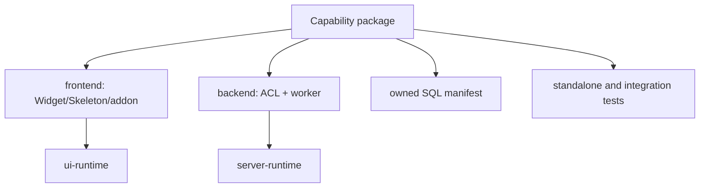

# Building a Kernel capability

A capability owns behavior end to end while using explicit runtime contracts.

| Concern | Kernel provides | Capability owns |
|---|---|---|
| Backend | descriptor registry, ACL orchestration, dispatch, transport | descriptor, worker, semantic validation, response |
| Frontend | LETC lifecycle, Skeleton/Kind loading, service/WebSocket clients | widgets, Skeletons, styles, event handling |
| ACL | public/domain/MFS evaluation mechanisms | requested scope/bitmasks and resource mapping |
| SQL | manifest validation and injected database seams | operational schema, procedures, migrations, version |
| Configuration | constructor injection patterns | documented capability settings and defaults |
| Packaging | CommonJS/package resolution contracts | declared dependencies, exports, assets, license |
| Tests | reusable runtime seams | unit, artifact, authorization, and integration proofs |

## Backend services

Use a JSON ACL descriptor to declare services, permissions, and public/private worker paths. The method is reached as `module.method`; do not add a special route or bypass dispatch. Workers receive trusted session and injected adapters. They must not select identity from client input.

For MFS scope, a capability supplies the mapping from service input to source/destination logical resources and effective permission lookup. The runtime owns the final decision. For domain scope, require explicit source privilege and allow the Domain authorizer to query the trusted identity/domain.

## Frontend loading

Build a bundle that registers one or more kinds through `Kind.registerAddons`. The host exposes a package-relative plugin `index.json`, and `bootstrap.plugin` returns its public entry path. Capabilities use the runtime service and WebSocket clients rather than raw session credentials or raw sockets.

## SQL ownership and availability

Ship operational SQL with the backend capability, preferably through a deterministic package-relative manifest. Installation and provisioning must be explicit, inspectable, versioned, and idempotent. Capability availability must validate lifecycle state and required objects; a locator or package installation alone is insufficient.

## Dependency rules

- Declare every package dependency or peer dependency; do not import sibling repositories, parent `node_modules`, `NODE_PATH`, `target/**`, or historical sources.
- Depend downward on runtime contracts, never from a generic runtime back into a capability.
- Keep physical database/filesystem locators behind backend adapters.
- Keep large payloads out of bounded structured service requests.
- Preserve standalone pack/install/test behavior where the capability is an extracted package.

The verified [First Capability](/kernel/getting-started/first-capability) demonstrates an anonymous service, domain-protected service, push event, and frontend Kind without SQL.

