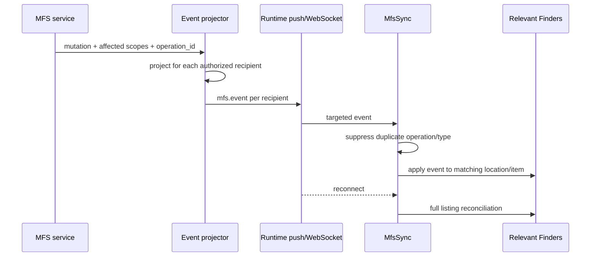
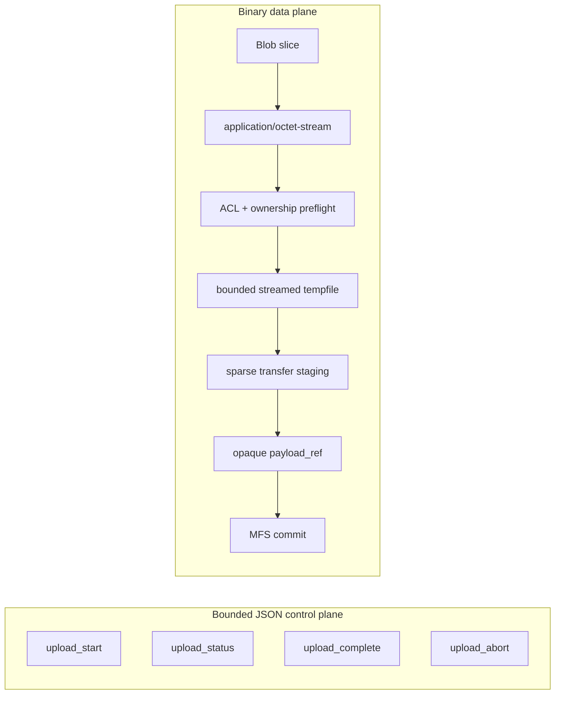

# Finder

Finder is currently a private Phase 4.8 integration module in `transient`, not a published standalone package. Its architecture separates the filesystem browser from its optional window shell:

```text
FinderWindow = Window Manager adapter around a Finder widget
Finder       = listing, navigation, selection, transfer, upload,
               download, and synchronization behavior
```

`Finder` can be mounted directly on `ui-runtime`. `FinderWindow` constructs that Widget and feeds it into a managed window. Canonical item identities are `{hub_id, nid}`.

Current components are `Finder`, `FinderWindow`, `ItemList`, `FinderSelection`, `SelectionMarquee`, `FinderDragController`, `FinderTransferPolicy`, `MfsClient`, `MfsTransferClient`, `MfsSync`, `UploadController`, `DownloadController`, and `TransferProgressView`. There are no current `FinderView`, `FinderItem`, or `ItemRenderer` classes; dense item tiles are deliberately rendered by `ItemList` through delegated HTML.

## Selection

A normal tile click replaces selection with that item. Its checkbox toggles that item without clearing others. A background pointer gesture starts marquee selection after a five-pixel threshold, normalizes forward or reverse geometry, compares against cached tile bounds, and incrementally selects intersecting items. Scrolling, resize, item changes, navigation, drag cleanup, and window interactions invalidate or cancel bounds/gestures as appropriate. Modifier-key additive selection is not implemented.

## Drag and transfer

Dragging starts after a five-pixel threshold and preserves an existing multi-selection. Dropping on another Finder delegates to this current policy:

```text
same hub      -> mfs.move
different hub -> mfs.copy
```

Logical nodes and destination use `{hub_id, nid}`. Finder generates an `operation_id` for transfer correlation. Same-shard move is also enforced by System MFS; cross-shard copy is an explicit tree-copy operation.

## Synchronization



The private MFS service owns semantic events and recipient projection; System MFS does not. `MfsSync` routes only events relevant to a Finder's source parent, destination, or visible node. It retains a bounded set of operation/type pairs for echo suppression. On WebSocket reconnect it refreshes every registered Finder. Tests verify that recipient B does not receive a private field visible to recipient A.

## Upload: control and data planes



Large data never becomes a JSON array of bytes. The browser scans mixed files/folders and recursive WebKit directory entries, creates folders (including empty folders), starts file sessions, honors server-selected chunk geometry, skips already-received indexes on resume, uploads chunks concurrently, retries each chunk up to three times, and completes or aborts. Current defaults use 8 MiB browser chunks; the server remains authoritative.

The transfer service owns temporary sparse staging, bounded maps/TTL, hash checks, and cleanup. System MFS sees only an opaque complete payload reference and adopts it into canonical content.

## Download

Selected roots are sent to `download_prepare`. The transfer service obtains an authorized recursive manifest through MFS service, prepares a ZIP in a finite child process, and exposes requester-scoped status, cancellation, retrieval, and release. The artifact remains on the filesystem; the validated online path uses an internal redirect so Nginx streams it. Progress is scoped to the requesting principal.

`DownloadController` also contains a Blob-based retrieval fallback for an injected transport, but the production integration proof validates offline archive preparation plus Nginx delivery. Historical `zipid` socket semantics are not a current Finder contract.

Source: `transient/target/modules/finder/`, `mfs-service/`, `mfs-transfer/`, and `tests/integration/kernel/phase4.8-*`.
