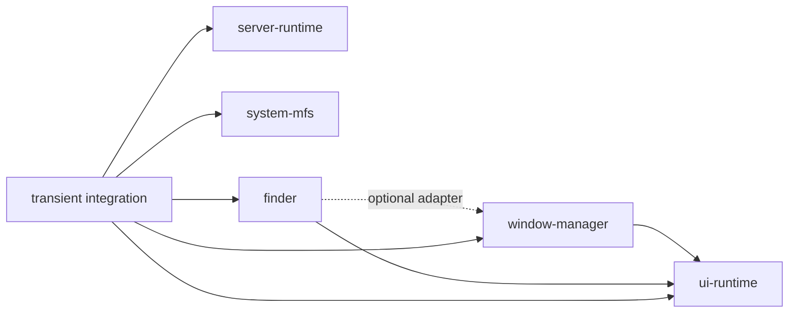

# Repository layout

The Minimal Kernel is not a monorepo product. Its stable extraction boundaries and its current integration workspace are separate.

| Repository | Package or role | Classification |
|---|---|---|
| `drumee/server-runtime` | `@drumee/server-runtime` | backend runtime |
| `drumee/ui-runtime` | `@drumee/ui-runtime` | browser runtime |
| `drumee/system-mfs` | `@drumee/system-mfs` | optional system capability |
| `drumee/window-manager` | `@drumee/window-manager` | optional UI capability |
| `drumee/finder` | `@drumee/finder` | optional UI/MFS browsing capability |
| `drumee/transient` | bootstrap, Hello, MFS service/transfer/media adapters, build and integration harness | integration/evidence workspace |

`server-runtime`, `ui-runtime`, and `system-mfs` do not depend on one another at npm package level. Window Manager declares `ui-runtime` as a peer. Finder declares `ui-runtime` as a peer and Window Manager as an optional peer. Integration code connects the browser capability to backend MFS-compatible services through injected transports and logical contracts.

Finder production code belongs to the public standalone [`drumee/finder`](https://github.com/drumee/finder) repository.

`transient` points validation at that checkout; it no longer owns a production filesystem-browser implementation.

See [Repositories & Packages](/kernel/repositories-packages) for ownership details.
