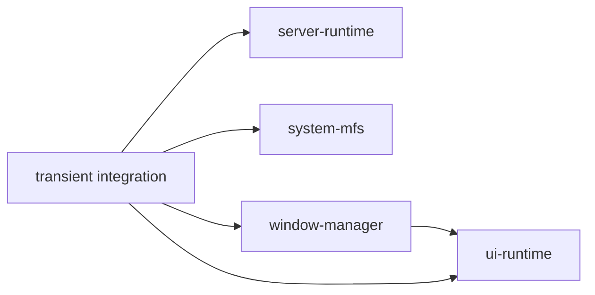

# Repository layout

The Minimal Kernel is not a monorepo product. Its stable extraction boundaries and its current integration workspace are separate.

| Repository | Package or role | Classification |
|---|---|---|
| `drumee/server-runtime` | `@drumee/server-runtime` | backend runtime |
| `drumee/ui-runtime` | `@drumee/ui-runtime` | browser runtime |
| `drumee/system-mfs` | `@drumee/system-mfs` | optional system capability |
| `drumee/window-manager` | `@drumee/window-manager` | optional UI capability |
| `drumee/transient` | private bootstrap, Hello, Finder, MFS service/transfer, build and integration harness | temporary integration repository |

`server-runtime`, `ui-runtime`, and `system-mfs` do not depend on one another at npm package level. Window Manager declares `ui-runtime` as a peer. Integration code connects these packages through injected stores, transports, and service adapters.

The current Finder package is named `@drumee/finder-integration-phase48`, is private, and declares `ui-runtime` plus optional `window-manager` peers. Do not treat that transitional name as a public package contract.

See [Repositories & Packages](/kernel/repositories-packages) for ownership details.
