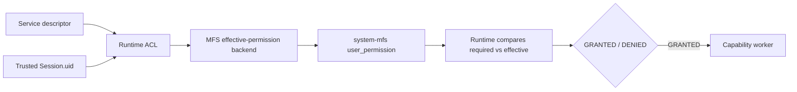

# Identity, authentication, and security

## Four separate concerns

- **Identity** answers which principal is attached to the runtime context.
- **Authentication** answers whether that principal completed the sign-in transition.
- **Authorization** evaluates the requested service/resource privilege.
- **Transport association** binds an HTTP session to a particular WebSocket.

Combining these concepts is a security regression. In particular, an OTP-pending session can have a real principal without being authenticated.

## Identity invariants

An established session has a non-null UID. Anonymous sessions resolve to the canonical nobody principal `ffffffffffffffff`; `uid()` falls back to that stable representation. The default organisation is ID `1`. Guest and privileged system identities are separately generated and must not alias nobody or each other.

The runtime consumes these platform invariants but does not provision them. The transitional bootstrap controller creates and validates them. `session_ensure` is also the targeted compatibility repair for historical cookie rows whose UID is null; it must not reset an OTP principal.

## HTTP and ACL boundary



Session identity comes only from a validated cookie or the current `x-param` bridge. Conflicting cookie/header sessions are rejected. Client-supplied `uid`, principal, shard database name, and filesystem locator are not authority.

Domain ACL requires signed-in state, an identity ID, an explicit domain ID, and a source privilege. MFS ACL requires logical source/destination resources and a trusted session UID. System MFS calculates effective MFS privilege through `user_permission()`; it does not make the final service-authorization decision. The runtime compares required and effective privileges and invokes the worker only after GRANTED. Both scopes fail closed when their backing adapter is absent.

Finder never makes authorization decisions. Client-supplied `uid`, `principal_id`, `owner_id`, or `user_id` is not authoritative. For upload and download operations, runtime ACL and server-side transfer ownership are complementary: ACL authorizes the logical resource operation, while ownership binds temporary transfer state to the trusted session principal. A transfer ID alone grants neither access nor authority.

## WebSocket association

```mermaid
sequenceDiagram
  participant UI as UI runtime
  participant HTTP as bootstrap.authn
  participant DB as Yellow Page session/socket store
  participant WS as WebSocket router
  UI->>HTTP: public transport setup
  HTTP->>DB: ensure regsid principal context
  HTTP->>DB: store fresh 22-char OTAK (60s)
  HTTP-->>UI: token; regsid cookie/header if allocated
  UI->>WS: service protocol + ?otak=token
  WS->>DB: socket_bind (atomic OTAK claim)
  DB-->>WS: socket_id + session_id
  WS->>DB: resolve claimed session
  WS-->>UI: sys.hello
```

`bootstrap.authn` intentionally remains a `public-api` fast path even though its descriptor has domain scope. It grants no business privilege. Its purpose is to ensure a principal-bearing session and issue a short-lived transport credential so anonymous and authenticated clients can establish the same generic push channel. Requiring an authenticated/domain grant here would prevent the transport needed before sign-in and would conflate channel association with authorization.

The socket URL contains the OTAK, never `regsid`. The WebSocket cookie is not authoritative. The router validates protocol and origin, atomically claims the OTAK through `socket_bind`, resolves only the returned session ID, and emits user identity in `sys.hello` only for authenticated sessions.

Redis carries targeted downstream envelopes. A capability chooses semantic recipients and must project recipient-safe event data; the router only delivers to resolved socket IDs.

Implementation references: `server-runtime/lib/session.js`, `input.js`, `domain-authorizer.js`, `permission.js`, `websocket-router.js`, `yellow-page-store.js`, and `service/bootstrap.js`.
