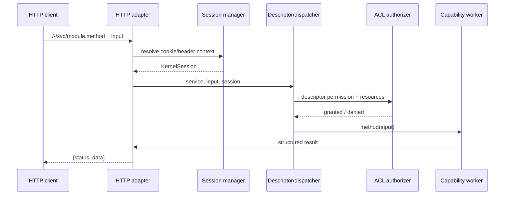

# Runtime contracts

## Request and service dispatch

The public backend unit is a logical `module.method` string. `DescriptorRegistry` validates ACL JSON, chooses the public or private implementation from session state, and resolves a package-relative worker. `ServiceDispatcher` authorizes before it loads or invokes the worker and calls `stop()` when present.

JSON request bodies are structured objects bounded to 64 KiB. Configured `application/octet-stream` services use a separate, bounded tempfile path with authorization and optional ownership preflight before the body is read.

## Identity and session

`KernelSession` exposes `identity()`, `principal()`, `uid()`, `isAnonymous()`, `isGuest()`, `isAuthenticated()`, and `sid`. A principal's presence does not imply successful authentication: guest and OTP states remain distinct. Domain identity contains an opaque ID and explicit numeric domain ID.

`regsid` is the historical HTTP session selector. It travels in an HttpOnly cookie and, for the current browser bridge, private `x-param-keysel: regsid` / `x-param-regsid` headers. UI runtime keeps the raw value in private transport state rather than Widget-visible runtime state.

## Authorization

Current public contracts are:

- explicit `public-api` fast path;
- `scope: domain`, evaluated by `domain_permission` against the trusted session identity;
- `scope: mfs`, where a capability maps inputs to logical `{hub_id, nid}` resources and supplies effective permissions while the runtime performs the final bitmask comparison.

Unknown or unconfigured scopes fail closed. Authentication and authorization are separate.

## Capability and plugin lookup

Backend descriptors are registered from directories of JSON files. Frontend logical plugin names resolve to a public bundle path through an `index.json`. UI runtime then waits for readiness, loads the bundle, and requires synchronous `Kind.registerAddons` registration.

## Configuration and errors

Runtimes use constructor-injected stores and adapters rather than a global application container. Errors carry stable machine codes through `RuntimeError`; HTTP maps authentication/session errors to 401, permission failures to 403, missing objects to 404, invalid input to 400, oversized upload chunks to 413, and unclassified failures to 500.

## Availability

Generic descriptor registration says a service exists; it does not prove an optional capability is provisioned. System MFS availability is a separate validated state derived from installation/provisioning records and actual shard objects—not from the mere presence of `entity.db_name`, `home_dir`, or `home_id`.

Implementation references: `server-runtime/lib/descriptor-registry.js`, `dispatcher.js`, `session.js`, `permission.js`, `http.js`, `plugin-resolver.js`; `ui-runtime/src/bootstrap.js`, `kind.js`, `service.js`.

