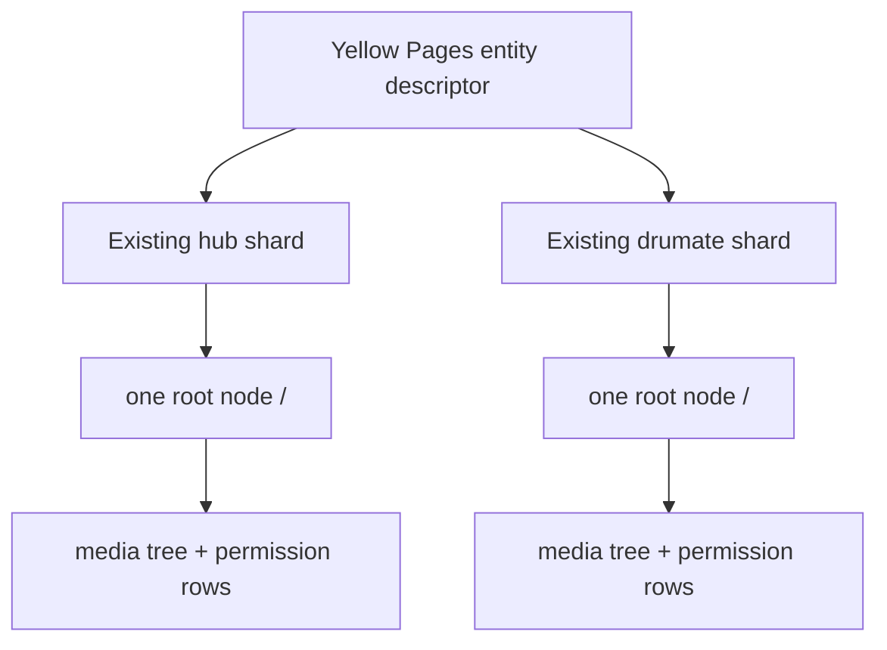

# `@drumee/system-mfs`

System MFS is an optional backend capability, not generic server machinery. It owns the logical filesystem closure and the SQL needed to install and provision it.

## Namespace and identity

Public resource identity is always `{hub_id, nid}`. Physical `db_name`, database/filesystem hosts, home directories, and canonical storage references remain internal.

Current provisioning supports existing `hub` and `drumate` entity shards. It does **not** create `mfs_<principal_id>` databases. Both shard classes use common SQL; class overlays are currently empty.

## Installation and provisioning

`install()` installs System MFS lifecycle tables in Yellow Pages. `provision()` resolves an existing entity by trusted host or `hub_id`, records provisioning state, installs the manifest-selected tables/functions/procedures into its assigned shard, creates exactly one root, grants the owner permission `63`, and records completion. Validation checks state and physical objects and fails closed on partial or conflicting installations.

The procedure-backed filesystem supports child listing, node lookup, directory creation, rename, hard removal, same-shard move, cross-shard tree copy, file reservation/commit, and recursive enumeration. A `LocalContentStore` can adopt an opaque staged payload into canonical filesystem content.

## Permission boundary

MFS SQL supplies `user_permission`, `parent_permission`, and expiry semantics. The service capability maps request inputs to resources. `server-runtime` performs the final required/effective bitmask comparison using the trusted Session UID. `MfsFilesystem` runs only after that ACL grant and retains structural/transactional checks.

## Deliberate exclusions

Current System MFS excludes identity creation, Hub/Team/DMZ policy, Finder, browser upload protocols, temporary chunks and sessions, transfer progress, archive jobs, WebSocket routing, trash, changelog, search, quota, and application synchronization. Historical Drumee may contain those behaviors; they are not System MFS dependencies.

Source: `system-mfs/lib/`, `system-mfs/schemas/`, and `system-mfs/test/`.
