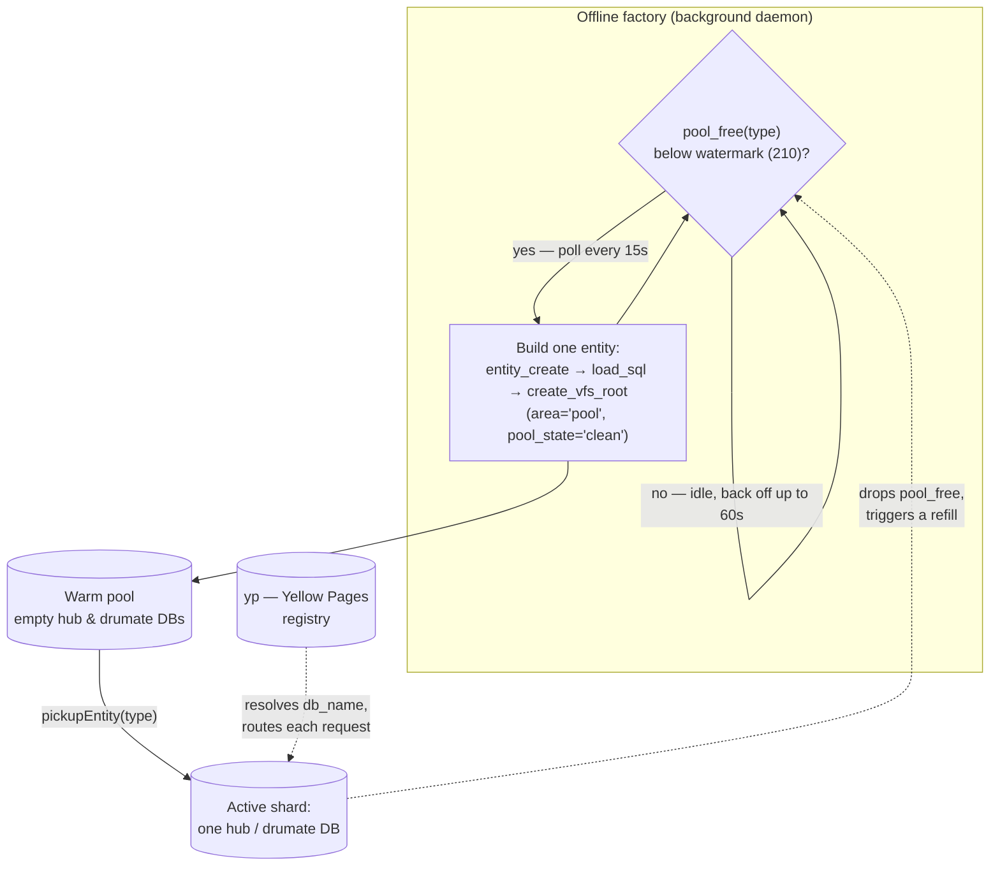

# Database Sharding & the Entity Pool

Drumee does not keep all tenants in one big schema. It **shards by entity**: every
workspace (`hub`) and every user (`drumate`) gets its **own MariaDB database** plus its
own [MFS](./03-mfs-architecture.md) storage root on disk. A single installation runs
hundreds or thousands of these databases side by side, with the central **Yellow Pages
(`yp`)** database acting as the registry that maps requests to the right shard.

This page explains the sharding model and the **offline factory** — the daemon that makes
sharding practical by pre-building databases in advance.

## The sharding model

| Entity type | Becomes | Has its own |
| :---- | :---- | :---- |
| `hub` | A collaborative workspace | MariaDB database, MFS storage root, members/roles/permissions, theme |
| `drumate` | A single user | MariaDB database, MFS storage root, personal contacts/tags/activity |

- **Strict isolation.** A tenant's data lives only in its own database; there is no shared
  table holding everyone's rows. A bug or a permission error in one shard cannot leak
  another tenant's data.
- **Shared definitions, separate data.** Every hub and drumate database is built from the
  same schema — the [`common` class](../api-reference/stored-procedures.md#the-shared-common-class)
  (MFS procedures, trash routines, shared tables) is deployed identically into each.
- **Routing.** When a request arrives, the session layer identifies the target entity
  (via the `Host` header / session) and the ACL layer resolves its `db_name`. All
  subsequent queries are scoped to that shard. See [Request Pipeline](./06-request-pipeline.md).

### Database naming

Every entity database is named by the `make_db_name()` SQL function as **`<x>_<id>`** — a
16-character hex `id` preceded by a single hex character and an underscore:

```sql
-- yellow_page/procedures/functions.sql
SELECT concat(substring(uniqueId(),-1,1), '_', uniqueId()) INTO _res;
```

The leading `<x>_` is a **meaningless bucketing prefix** — it does *not* encode the entity
type (`9_` does not mean "user"). It exists to spread databases across the namespace so the
database engine can optimise (distributing on-disk schema directories rather than clustering
thousands of similarly-named databases). The only fixed name is `yp`. See
[Database Naming Conventions](../api-reference/stored-procedures.md#database-naming-conventions).

## Why a pre-provisioning factory

Provisioning a new shard is expensive: `CREATE DATABASE`, load the full schema (routines,
tables, triggers), create the on-disk MFS storage directory, `chown` it, and create the VFS
root node. Doing all of that **synchronously while a user waits** for "create workspace" or
"sign up" would be slow.

Instead, Drumee keeps a **warm pool** of ready-made, empty entities. Each pooled entity is a
fully built `hub` or `drumate` database marked `area='pool'`. When a real workspace or user
is needed, the application simply **claims** a clean pool entity and flips it into active use
— there is no schema build on the hot path.




## The factory daemon

The factory (`offline/factory/`) is a long-running background daemon that tops the pool up.
It is **not** started by `npm run dev`; its entry point is `offline/drumate.js`, and it runs
as its own PM2 process (`factory`).

```
offline/drumate.js        # entry point: new Factory({type:'drumate', schemas}).start()
offline/factory/index.js  # __drumee_factory (extends Offline) — the daemon loop
offline/factory/schema.js # __schema — builds one entity at a time
```

### Watermark (target pool size)

The factory keeps at least **`watermark`** clean entities of each type in the pool. The
default is **210** for both `hub` and `drumate`, overridable via config (`watermark.hub` /
`watermark.drumate`):

```js
this.watermark = {
  hub: watermark.hub || 210,
  drumate: watermark.drumate || 210,
};
```

Current depth comes from the `pool_free(type)` SQL function, which counts rows in
`yp.entity` where `area='pool'` and `type=_type`.

### Startup

1. Open a `yp` connection and resolve the per-type watermarks.
2. `checkSanity()` — refuse to run in unsafe conditions (see below).
3. Build the **SQL templates** for both types (unless `--rebuild=no` and cached templates
   already exist).
4. Enter the infinite `run()` loop.

A **template** is a schema-only `mysqldump` (`--routines --quick --no-data
--single-transaction --skip-comments`) of the first `active` entity of that type in domain
`1`, written to `/tmp/drumee-template-<type>.sql` with a `.ok` sentinel marking completion.
It is the blueprint copied into every new entity of that type.

### The run loop

An infinite `while (1) await run()`. Each pass, for each type:

1. `check_pool(type)` → returns the current count **only if** it is `>= watermark`, else `0`.
2. If the template `.ok` sentinel is gone → abort ("Exit due to doubious template!").
3. If the pool is **below** watermark → set the loop timer to **15 s** and build one more
   entity via `make_schema(type)`.
4. If the pool is **full** → ramp the timer up by 1 s each idle pass (capped at **60 s**) to
   back off polling.

So the daemon polls aggressively while it has work to do, and idles ever more lazily once the
pool is satisfied.

### Building one entity

`make_schema(type)` runs `create_entity()` on a `__schema` instance:

1. **`entity_create(type)`** (`yellow_page/procedures/entity/create.sql`) — inserts an
   `entity` row with `area='pool'`, `status='frozen'`, and runs `CREATE DATABASE`.
2. **`load_sql()`** — pipes the cached `/tmp` template dump into the new database.
3. **`create_vfs_root()`** — `mkdir -p <home_dir>/__storage__`, `chown` it to the system
   user, then `mfs_create_node` for the root node and sets `entity.home_id`.
4. Marks the entity reusable: `settings.pool_state = "clean"`.

On any failure, `delete_entity()` rolls everything back (`entity_delete` + `rm -rf` of the
validated home dir) and the error propagates so the loop retries next pass.

### How pooled entities are consumed

The factory only **produces**. Consumption happens elsewhere via **`pickupEntity(type)`**
(`yellow_page/procedures/utils/pickupEntity.sql`), which claims a random pool entity whose
`settings.$.pool_state = 'clean'`, moving it out of `area='pool'`. That drops `pool_free`,
which eventually triggers the factory to build a replacement.

## ⚠️ Restart the factory after schema patches

**When you patch `hub`-, `drumate`-, or `common`-class schemas, you must restart the factory.**

The template is dumped **once at startup** and cached in `/tmp/drumee-template-<type>.sql`.
The run loop reuses that cached dump for every entity it provisions and **never re-reads the
schema** while running. So any routine, table, or trigger change patched into the live
databases will **not** reach newly pooled entities until the factory restarts and re-dumps the
template. Until then the pool keeps handing out entities built from the **old** schema.

After applying such patches:

1. Patch the reference/active schemas as usual (`bin/patch-from-manifest`, etc.).
2. **Restart the factory** so it re-dumps the current schema (not with `--rebuild=no`, which
   keeps the stale cached dump).
3. Optionally drain the pool entities built before the patch — they will not contain the new
   definitions.

## Operational notes

- **Primary only.** The factory creates databases; `checkSanity()` aborts if `SHOW SLAVE
  STATUS` reports a running replica.
- **Privileged.** Must run as `root` or the configured `system_user` (needed to `chown` MFS
  directories).
- **`--rebuild=no`.** Skips rebuilding templates at startup if cached `/tmp` dumps and their
  `.ok` sentinels already exist.
- **Tune pool size** with `watermark.hub` / `watermark.drumate` (default 210 each).
- **Inspect the pool:** `SELECT type, COUNT(*) FROM entity WHERE area='pool' GROUP BY type;`
  and the `admin.show_watermark` service.

## Key SQL touchpoints

| Routine | Where | Role |
| :---- | :---- | :---- |
| `make_db_name()` | `yellow_page/procedures/functions.sql` | Generate the `<x>_<id>` shard database name |
| `pool_free(type)` | `yellow_page/procedures/admin/pool_free.sql` | Count clean pool entities of a type |
| `entity_create(type)` | `yellow_page/procedures/entity/create.sql` | Insert entity row + `CREATE DATABASE` |
| `entity_delete(id)` | `yellow_page/procedures/entity/delete.sql` | Roll back a half-built entity |
| `pickupEntity(type)` | `yellow_page/procedures/utils/pickupEntity.sql` | Claim a clean pool entity |
| `mfs_create_node` | `common/procedures/mfs/` | Create the entity's MFS root node |
