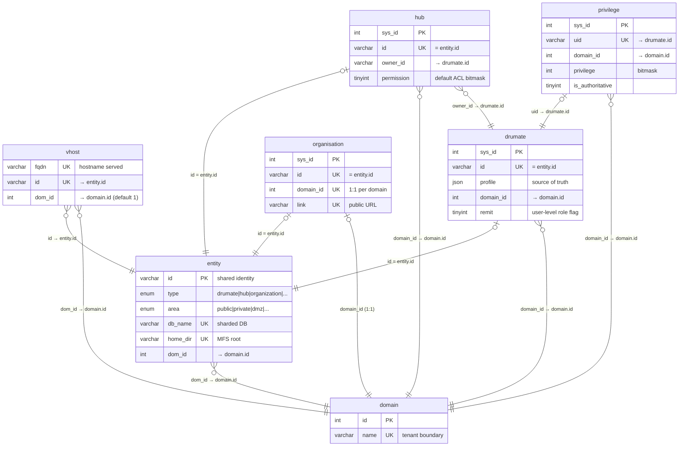
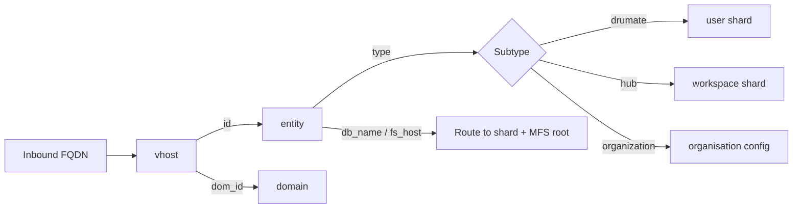
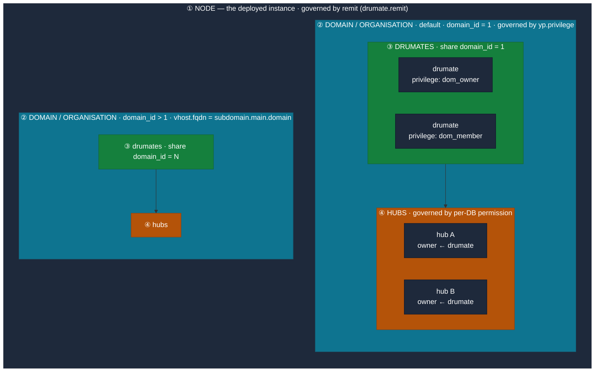
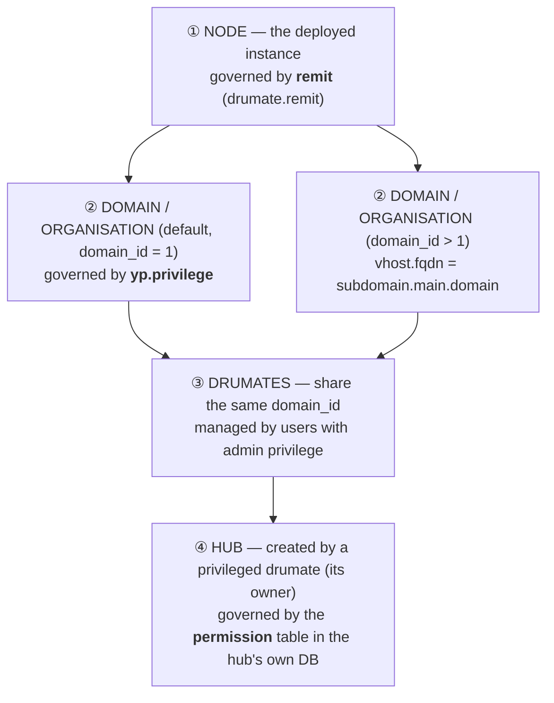
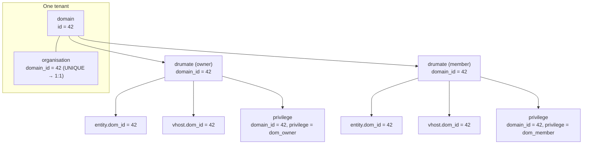
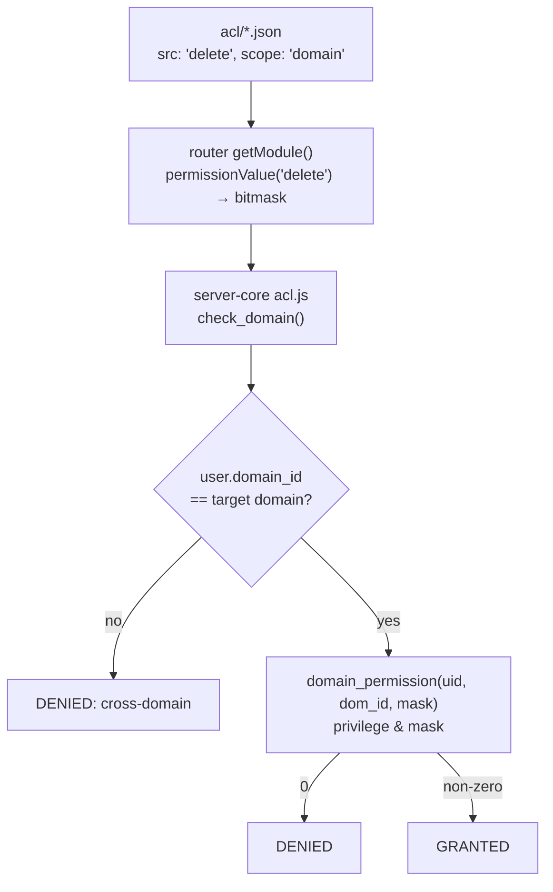

# Yellow Pages Schema — the Entity Model

The **Yellow Pages** (`yp`) database is the central registry of a Drumee installation. While
each user and workspace lives in [its own sharded database](./07-database-sharding.md), `yp`
is the single directory that answers *"what exists, who owns it, which host serves it, and
what is this hostname?"* — the map every request is resolved against before dispatch.

This page describes the core tables of that registry and how they fit together.

:::info Source of truth
These tables are defined in the [`schemas`](https://github.com/drumee) repository under
`yellow_page/tables/`. This page reflects the live (British-spelled) tables; see
[Legacy twins](#legacy-twins) for the deprecated duplicates you may still encounter.
:::

## The central idea: `entity` is a polymorphic supertype

Drumee uses **single-table inheritance keyed by a shared `id`**. The `entity` table holds one
row per *thing that exists* — a user, a workspace, an organization. The subtype tables
(`drumate`, `hub`, `organisation`) reuse the **same 16-character `id`** as their own identity,
and `entity.type` records which subtype a row is.

To resolve any object generically you join through `entity`; `entity.type` tells you which
subtype table holds the rest of its data.



## Request resolution flow

A request arrives at a hostname and is resolved through the registry before any application
code runs:



## Access-control hierarchy: node → domain → drumate → hub

Drumee is built to be **self-hosted**, so access control is organized as four nested tiers.
Each tier is governed by a **different table**, and each is physically *contained* by the one
above it:



*Containment ⇒ governance:* the **node** holds one or more **domains/organisations**; each
domain holds the **drumates** that share its `domain_id`; privileged drumates own the **hubs**
inside that domain. The governing table changes at each boundary — `remit` → `privilege` →
`privilege` (admin tier) → per-hub `permission`.

The same relationship as a top-down tree, showing each tier's governing table:

Default and additional domains behave **identically** — the only difference is `domain_id`
(and, for additional ones, the subdomain FQDN). So both flow into the same drumate and hub tiers:



### ① Node — the whole instance (`remit`)

The top of the hierarchy is the **node**: the deployed Drumee instance itself. Node-wide rights
(platform administration, casting/mimicking other users, cross-domain operations) are governed
by **remit**. In practice the authoritative value lives in the **`drumate.remit`** column
(`tinyint`), read at request time by the `get_remit(uid)` SQL function and tested bitwise in
`server-core/lib/acl.js` (`check_remit`) for services declaring `scope: "plateform"`. The
`remit` bit tiers are defined in `server-essentials/lib/lex/remit.js` (`root`, `dom_owner`,
`dom_admin`, … down to `dom_member`).

There is also a standalone **`yp.remit` table** (`method → level`, a `bit(3)` per service method)
intended as a method-to-required-level map, but **no stored procedure or service currently
queries it** — the live node check reads `drumate.remit`. Treat the table as legacy/aspirational
(see [its entry below](#remit--node-level-access-map-legacy)).

### ② Domain / organisation (`yp.privilege`)

A node hosts **at least one organisation**, attached to the **default domain (`domain_id = 1`)**.
Additional organisations get their own domain with **`domain_id > 1`**, addressed by a subdomain
— `vhost.fqdn = subdomain.main.domain`. The acting domain is resolved either **from the request
URL** (via [`vhost`](#vhost--hostname--entitydomain-routing) → `get_hub`) **or from a `domain_id`
passed in the query**. Access within a domain is governed by
[**`yp.privilege`**](#how-privilege-is-enforced) — the per-user, per-domain bitmask.

### ③ Drumates within a domain

All users of an organisation **share the same `domain_id`** (see
[Hierarchical structure](#hierarchical-structure-how-drumates-belong-to-an-organisation) below).
They are administered by the drumates who hold an **admin-tier `privilege`** in that domain, who
can grant/revoke membership and rights via `domain_grant`.

### ④ Hub (per-DB `permission`)

A drumate with sufficient domain privilege can **create a hub**, becoming its **owner**. Access
to a hub is *not* governed by `yp` — it is governed by the **`permission`** table inside the
**hub's own sharded database** (see [Database Sharding](./07-database-sharding.md)), evaluated
per MFS node by the shard-local `acl_check` procedure. This is the tier the default (no-`scope`)
ACL path exercises.

| Tier | Scope value in ACL | Governing table | Check path |
|---|---|---|---|
| ① Node | `plateform` | `drumate.remit` (+ legacy `yp.remit`) | `get_remit(uid) & mask` |
| ② Domain | `domain` | `yp.privilege` | `domain_permission(uid, dom_id, mask)` |
| ③ Drumate | — | `yp.privilege` (admin tier) | membership via `domain_grant` |
| ④ Hub | *(none)* / `hub` | per-hub-DB `permission` | shard `acl_check` |

## Tables

### `vhost` — hostname → entity/domain routing

The DNS/HTTP entry point. Maps an inbound fully-qualified domain name to the entity that
serves it and the domain it belongs to. It sits *in front of* the supertype model.

| Column | Type | Notes |
|---|---|---|
| `sys_id` | `int unsigned` AUTO_INCREMENT | Internal PK |
| `fqdn` | `varchar(256)` ascii, **UNIQUE** | The hostname served (e.g. a custom domain) |
| `id` | `varchar(16)` ascii, **UNIQUE** | → `entity.id` |
| `dom_id` | `int unsigned` (default `1`) | → `domain.id` |

Complements the denormalized `entity.vhost` column: the `vhost` **table** is the authoritative
many-FQDN-to-one-entity lookup.

### `domain` — the tenant boundary

The hub of the relational model. Nearly every other table carries a `dom_id`/`domain_id`
pointing here.

| Column | Type | Notes |
|---|---|---|
| `id` | `int` AUTO_INCREMENT | PK |
| `name` | `varchar(1000)`, **UNIQUE** (HASH) | Domain name |

### `entity` — the universal object

One row per thing that exists. Holds the discriminator, the visibility zone, and the physical
routing columns that map a logical object to its actual database and filesystem host.

| Column | Type | Notes |
|---|---|---|
| `id` | `varchar(16)` ascii | **PK** — the identity every subtype shares |
| `type` | `enum` | `organization`, `hub`, `drumate`, `shop`, `blog`, `forum`, `guest`, `dummy` |
| `area` | `enum` | Visibility zone: `public`, `share`, `limited`, `restricted`, `private`, `personal`, `system`, `dmz-*`, `pool`, `template`, … |
| `db_name` | `varchar(255)` ascii, **UNIQUE** | The entity's own sharded database |
| `db_host`, `fs_host` | `varchar(255)` | Which DB / filesystem host serves it |
| `home_dir` | `varchar(512)`, **UNIQUE** | MFS storage root |
| `home_id` | `varchar(16)`, **UNIQUE** | Root node in the MFS tree |
| `dom_id` | `int unsigned` | → `domain.id` (the `domain` varchar column is a denormalized copy) |
| `status` | `enum` | `active`, `frozen`, `deleted`, `archived`, `system`, `locked`, `online`, `offline`, `hidden` |
| `space` | `float` | Storage **usage** |
| `settings` | `mediumtext` | JSON blob (FULLTEXT indexed) |
| `ctime`, `mtime` | `int unsigned` | Unix timestamps |

:::warning Deprecated columns
`homepage` and `layout` (and the `home_layout` region) are explicitly marked
`TO BE REMOVED` in the schema — do not build on them.
:::

### `drumate` — a user (entity subtype)

The user record. Its `id` equals the corresponding `entity.id`. The `profile` JSON column is
the **source of truth**; almost every readable field is a **VIRTUAL generated column** derived
from it.

| Column | Type | Notes |
|---|---|---|
| `sys_id` | `int unsigned` AUTO_INCREMENT | Internal PK |
| `id` | `varchar(16)` ascii, **UNIQUE** | = `entity.id` |
| `username` | `varchar(80)` | Unique per domain via `(username, domain_id)` |
| `domain_id` | `int unsigned` | → `domain.id` |
| `remit` | `tinyint` | **Node-level** access tier (see [`remit`](#remit--node-level-access-map-legacy)); read by `get_remit()` for `plateform`-scope services |
| `profile` | `longtext` JSON (`json_valid` CHECK) | Source of truth — **writes go here** |
| `firstname`, `lastname`, `fullname` | VIRTUAL | From `profile` (`fullname` falls back to email) |
| `avatar`, `lang`, `email`, `dmail`, `quota` | VIRTUAL | Projections of `profile` |
| `allow_search` | VIRTUAL | From `$.privacy.visibility` |
| `otp`, `connected` | VIRTUAL | From `profile` |

`email` and `id` are unique. Note the **usage/limit split**: `entity.space` is usage,
`drumate.quota` (from profile JSON) is the limit.

### `hub` — a collaborative workspace (entity subtype)

A workspace, addressed by `hubname`. Its `id` equals the corresponding `entity.id`.

| Column | Type | Notes |
|---|---|---|
| `sys_id` | `int unsigned` AUTO_INCREMENT | Internal PK |
| `id` | `varchar(16)` ascii, **UNIQUE** | = `entity.id` |
| `hubname` | `varchar(80)`, **UNIQUE** | Addressable slug |
| `owner_id` | `varchar(16)` ascii | → `drumate.id` |
| `origin_id` | `varchar(16)` | Source hub when cloned/shared |
| `serial` | `int unsigned` | Unique per owner via `(owner_id, serial)` |
| `permission` | `tinyint unsigned` | Default bitwise [ACL](./02-acl-system.md) for the hub |
| `name`, `description`, `keywords` | text | FULLTEXT index on `(name, keywords)` |
| `profile` | `mediumtext` | JSON |
| `domain_id` | `int unsigned` | → `domain.id` |

### `organisation` — per-domain tenant configuration

Effectively a **1:1 settings record per domain** (`domain_id` is UNIQUE). Holds the tenant's
security and directory policy. Its `id` is an `entity.id` of type `organization`.

| Column | Type | Notes |
|---|---|---|
| `sys_id` | `int unsigned` AUTO_INCREMENT | Internal PK |
| `id` | `varchar(16)` ascii, **UNIQUE** | = `entity.id` |
| `domain_id` | `int`, **UNIQUE** | → `domain.id` (1:1) |
| `owner_id` | `varchar(16)` ascii, **UNIQUE** | → `drumate.id` |
| `link` | `varchar(1024)`, **UNIQUE** | The org's public URL |
| `ident` | `varchar(80)` | Unique per domain via `(ident, domain_id)` |
| `password_level`, `double_auth`, `usb_auth` | int/flags | Authentication policy |
| `dir_visibility`, `dir_info` | `varchar(40)` | Directory-listing controls |
| `metadata` | `longtext` JSON | Extra config |

### `privilege` — per-user, per-domain rights

Maps a user to a **bitwise privilege scoped to a domain**.

| Column | Type | Notes |
|---|---|---|
| `sys_id` | `int unsigned` AUTO_INCREMENT | Internal PK |
| `uid` | `varchar(16)` ascii, **UNIQUE** | → `drumate.id` (one row per user) |
| `domain_id` | `int unsigned` | → `domain.id` |
| `privilege` | `int unsigned` | The permission bitmask (see [ACL system](./02-acl-system.md)) |
| `is_authoritative` | `tinyint` | Whether this record is authoritative |

### `remit` — node-level access map (legacy)

The node-tier counterpart to `privilege`: a lookup of **service method → required level**.

| Column | Type | Notes |
|---|---|---|
| `method` | `varchar(255)`, **UNIQUE** | Service method name |
| `level` | `bit(3)` | Required node-level tier |

:::warning Not wired up
No stored procedure or service queries this table. The **live** node-level check reads the
[`drumate.remit`](#drumate--a-user-entity-subtype) column via `get_remit(uid)` and tests it
bitwise (`server-core/lib/acl.js` → `check_remit`) for `scope: "plateform"` services. Treat the
`remit` table as legacy/aspirational; the authoritative node privilege is the `drumate.remit`
column, with tiers from `server-essentials/lib/lex/remit.js`.
:::

## Hierarchical structure: how drumates belong to an organisation

Drumee has no explicit "membership" join table between users and organisations. Instead the
hierarchy is expressed entirely through a **single shared key — `domain_id`** — that threads
through every table. The `domain` row is the pivot; the `organisation` sits 1:1 on top of it;
and every user, entity, and hostname that shares that `domain_id` is, by definition, part of
that organisation.



The membership rule is simply:

> A drumate belongs to an organisation **iff** `drumate.domain_id == organisation.domain_id`.

Because `organisation.domain_id` is **UNIQUE**, a domain maps to exactly one organisation, so
`domain_id` unambiguously identifies both the tenant *and* the org.

### `domain_id` across the tables

| Table | Column | Meaning within the hierarchy |
|---|---|---|
| `domain` | `id` (PK) | The pivot — the tenant boundary |
| `organisation` | `domain_id` (**UNIQUE**) | The org config, 1:1 on the domain |
| `drumate` | `domain_id` | Which org the user is a member of |
| `entity` | `dom_id` | The user/hub/org's entity row, tagged with its tenant |
| `vhost` | `dom_id` | Which tenant an inbound hostname resolves to |
| `privilege` | `domain_id` | The user's rights **within that org** (`(uid, domain_id)`) |

Every scoped query on a tenant is therefore a `WHERE domain_id = ?` (or `dom_id = ?`) filter —
listing an org's members is `SELECT * FROM drumate WHERE domain_id = ?`, and the
[cross-domain isolation check](#3-the-domain-check-in-the-core-acl-engine) is just an equality
test on this key.

### Binding a drumate: the `domain_grant` pivot

Membership changes go through one procedure, `domain_grant`, which keeps every table's
`domain_id`/`dom_id` in sync atomically. Creating an organisation
(`server-team/service/private/organization.js#add`) shows the full sequence:

```js
let domain = await this.yp.await_proc('domain_create', ident);            // 1. create the pivot
await this.yp.await_proc('domain_grant', domain.id, Remit.dom_owner, this.uid, 1); // 2. bind owner
recds.domain_id = domain.id;
org = await this.yp.await_proc('organisation_add', this.uid, name, domain.name, ident, domain.id, ...); // 3. 1:1 org
```

`domain_grant` (`yellow_page/procedures/domain/domain_grant.sql`) rebinds the user into the
domain by touching **four tables** at once:

```sql
INSERT IGNORE INTO privilege (uid, privilege, domain_id) VALUES (_uid, _privilege, _domain_id)
  ON DUPLICATE KEY UPDATE privilege = _privilege, domain_id = _domain_id;   -- rights in the org
UPDATE drumate SET domain_id = _domain_id WHERE id = _uid;                  -- membership
UPDATE vhost   SET dom_id    = _domain_id WHERE id = _uid;                  -- hostname routing
UPDATE entity  SET dom_id    = _domain_id WHERE id = _uid;                  -- entity tenant tag
```

So a single `domain_grant(org_domain_id, privilege, uid)` call is what **moves a user into an
organisation** — it simultaneously sets their membership (`drumate`), their rights
(`privilege`), their entity's tenant tag (`entity`), and their hostname's tenant (`vhost`). The
first call (with `Remit.dom_owner`) binds the founder; later calls with lower privilege tiers
(e.g. `dom_member`) add ordinary members to the same `domain_id`.

:::note Two privilege bases coexist
Notice the founder is granted `Remit.dom_owner` — domain/org privileges use the **cumulative
`remit` tiers** (`dom_owner`, `dom_admin`, `dom_admin_security`, `dom_member`), distinct from
the per-node hub `permission` bits. See the
[two-permission-maps warning](#how-privilege-is-enforced) above for why that distinction matters.
:::

## Relationship summary

| From | Column | To | Meaning |
|---|---|---|---|
| `vhost` | `id` | `entity.id` | Hostname belongs to entity |
| `vhost` | `dom_id` | `domain.id` | Hostname's tenant |
| `entity` | `dom_id` | `domain.id` | Entity's tenant |
| `drumate` | `id` | `entity.id` | User *is* an entity |
| `hub` | `id` | `entity.id` | Workspace *is* an entity |
| `organisation` | `id` | `entity.id` | Org *is* an entity |
| `drumate` | `domain_id` | `domain.id` | User's tenant |
| `hub` | `owner_id` | `drumate.id` | Workspace owner |
| `organisation` | `domain_id` | `domain.id` | 1:1 tenant config |
| `privilege` | `uid` | `drumate.id` | User's rights |

## How `privilege` is enforced

The `privilege` table is consulted for services that operate at **domain scope** — tenant-wide
operations rather than per-file actions. Tracing one such request end to end shows how a
symbolic permission name in an ACL file becomes a bitwise check against `yp.privilege`.

### 1. The ACL declaration

Each backend declares permissions per `module.method` in `acl/*.json`. A domain-scoped service
looks like this (`server-team/acl/mfs.json`):

```json
"server_export": {
  "scope": "domain",
  "permission": { "src": "delete" }
}
```

`scope: "domain"` routes the check to the domain path; `src` is a **symbolic** permission name,
not a number.

### 2. Symbolic → numeric resolution (at dispatch)

The REST router resolves the symbolic name to a bitmask when it looks up the service — **not**
in the core ACL engine, which only ever sees numbers:

```js
// server-team/router/rest/index.js — Acl.getModule()
if (permission.src)  permission.src  = permissionValue(permission.src);
if (permission.dest) permission.dest = permissionValue(permission.dest);
permission.scope = scope;
```

`permissionValue()` (from `@drumee/server-essentials`, `lib/lex/permission.js`) maps the name to
a bit via a small lookup:

```js
function value(k, def){
  if (typeof(k) === 'number') return k;   // idempotent — numbers pass through
  return def[k] || 0;                       // unknown name → 0 → fail-closed (deny)
}
```

This is **idempotent** (safe to run on every request against the cached module map) and
**fail-closed** (an unrecognized name resolves to `0`, which no bitmask can satisfy).

### 3. The domain check (in the core ACL engine)

The resolved numeric `permission` reaches `server-core/lib/acl.js`. For domain scope it runs
`check_domain()`, which enforces two things:

1. **Tenant isolation** — the acting user's `drumate.domain_id` must equal the target
   resource's domain. A user can only run domain-scoped services against **their own** tenant.
2. **Bitwise privilege** — it calls the `yp` SQL function `domain_permission()`:

```sql
-- yellow_page/procedures/domain/permission.sql
SELECT privilege & _perm FROM privilege
  WHERE uid = _uid AND domain_id = _dom_id INTO _res;
RETURN IFNULL(_res, 0);
```

A non-zero result grants the request. A user with no `privilege` row gets `0` → denied.



:::warning Two permission maps — checked vs. stored
`server-essentials/lib/lex/` defines several bit maps with **different layouts**. The domain
path crosses two of them:

- The router resolves ACL `src`/`dest` through **`permission.js`** (positional single-bit:
  `read = 0b0000010`, `delete = 0b0001000`).
- Domain privileges are **written** to `yp.privilege.privilege` through **`remit.js`**
  (cumulative threshold: `dom_admin = 0b0011111`, `dom_admin_security = 0b0001111`, …) — e.g.
  `service/private/organization.js` grants with `Remit.dom_owner`.

`domain_permission()` then computes `stored & asked` across the two encodings. The gates happen
to land on sensible domain-admin tiers **only because the bit positions overlap** — not because
the maps share a definition. Shifting a bit in either map would silently mis-gate these services
(with no error, since the path is fail-closed). Treat the two maps as coupled when editing
either.
:::

:::note Scope spellings
`check_domain()` only enforces the checks when `scope` is exactly `"domain"`. The
`"organisation"`/`"organization"` spellings short-circuit to *granted*, but **no live service
uses them** (all 9 domain-scoped services in `server-team` use `"domain"`), so this is currently
dead code rather than a reachable bypass.
:::

## Notes & gotchas

- **No declared FOREIGN KEY constraints.** Referential integrity is enforced in application and
  stored-procedure code, not by the database. The relationships above are join conventions, not
  DB-level constraints.
- **JSON is the source of truth for `drumate`.** Its flat columns are read-only VIRTUAL
  projections of `profile` — always write to `profile`.
- **Unix-timestamp integers**, not `DATETIME`, are used for `ctime`/`mtime`.

### Legacy twins

Some deprecated duplicate tables exist alongside the live ones. Prefer the singular /
British-spelled tables:

| Live table | Legacy twin | Difference |
|---|---|---|
| `domain` | `domains` | `domains` is utf8mb3, `name varchar(50)`, no unique key — unused |
| `organisation` | `organization` | `organization` has `home` instead of `link`; migration twin |
| — | `organisation_entity` | ID-remapping scratch table (`org_id ↔ old_id/temp_id`), not part of the runtime model |
